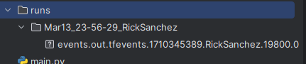
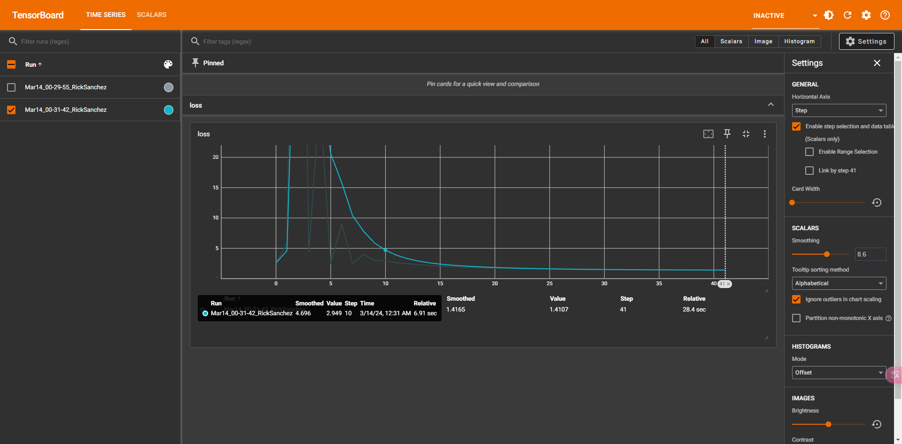

> 话不多说，开始准备环境

- cuda: CUDA
- torch: PyTorch
- torchvision: PyTorch 处理计算机是视觉任务的模块
- tensorboard: 模型可视化
- tensorflow: TensorFlow


## 第一道菜：最简单的模型

```python
import torch
import torchvision
from PIL import Image
from torch.utils.tensorboard import SummaryWriter

if __name__ == '__main__':
    writer = SummaryWriter()
    # 构建非预训练模型
    model = torchvision.models.resnet50(pretrained=False)
    # 数据处理器
    processor = torchvision.transforms.Compose([
        torchvision.transforms.ToTensor(),
    ])
    # 这里只要5个类别
    model.fc = torch.nn.Linear(model.fc.in_features, 5)
    # 为了简单，只训练单个图片
    image = Image.open("./data/img.png")
    image = processor(image)
    # 需要 4个维度: 批次\通道\宽\高
    image = image.unsqueeze(0)
    # 定义计算的损失函数
    ce = torch.nn.CrossEntropyLoss()
    # 定义优化器
    optimize = torch.optim.SGD(params=model.parameters(), lr=0.05)
    # 使用 cuda
    model = model.to('cuda')
    image = image.to('cuda')
    # 训练模式
    model.train()
    # 训练，训练10次
    for _ in range(10):
        optimize.zero_grad()
        output = model(image)
        print(output)
        # 计算 loss
        loss = ce.forward(output, torch.tensor([[0, 1, 0, 1, 0]], dtype=torch.float32).to('cuda'))
        # 添加损失函数图
        writer.add_scalar('loss', loss, global_step=i)
        loss.backward()
        optimize.step()
    print(model(image))
    # 写入日志
    writer.flush()
    writer.close()
```

运行之后会生成 `runs` 目录




运行

```bash
tensorboard --logdir=runs
```

然后打开: `http://127.0.0..1:6060`





## 参考:

  - [How to use TensorBoard with PyTorch](https://pytorch.org/tutorials/recipes/recipes/tensorboard_with_pytorch.html)
