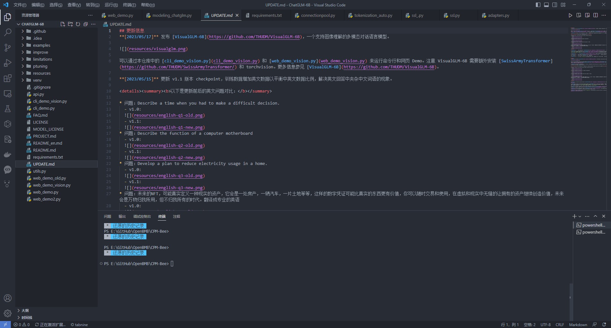
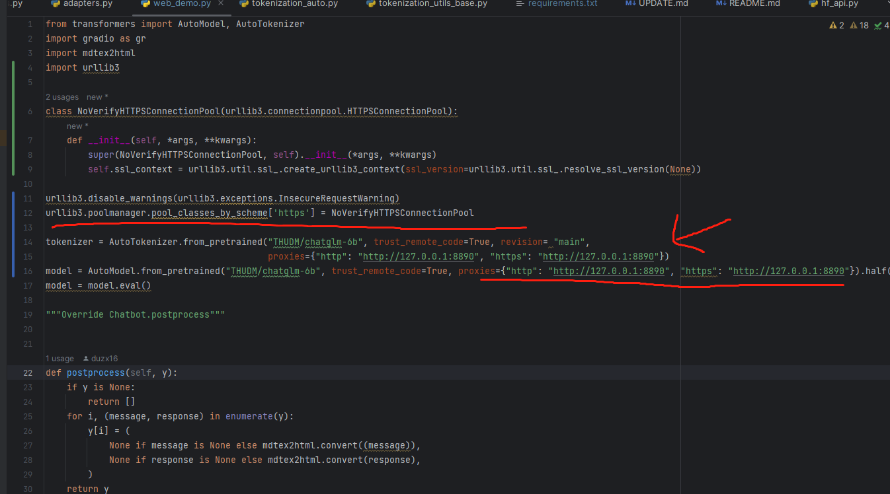
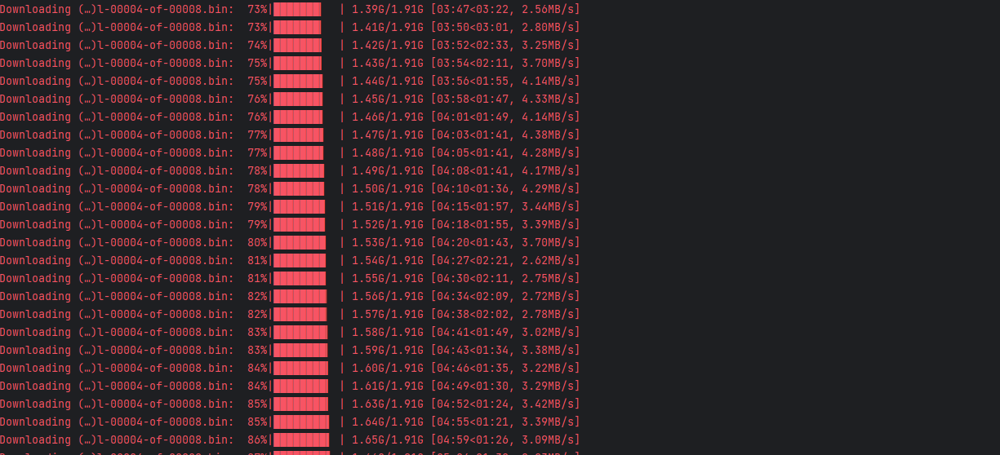
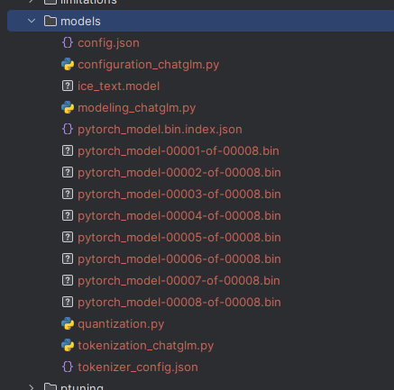
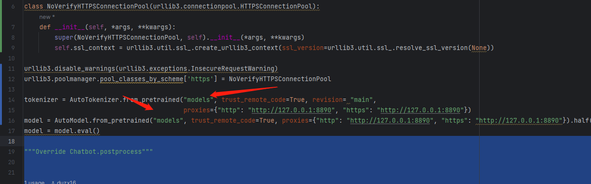

# ChatGLM-6B

## 介绍
ChatGLM-6B 是一个开源的、支持中英双语的对话语言模型，基于 General Language Model (GLM) 架构，具有 62 亿参数。
结合模型量化技术，用户可以在消费级的显卡上进行本地部署（INT4 量化级别下最低只需 6GB 显存）。 
ChatGLM-6B 使用了和 ChatGPT 相似的技术，针对中文问答和对话进行了优化。
经过约 1T 标识符的中英双语训练，辅以监督微调、反馈自助、人类反馈强化学习等技术的加持，62 亿参数的 ChatGLM-6B 已经能生成相当符合人类偏好的回答，更多信息请参考我们的博客。
为了方便下游开发者针对自己的应用场景定制模型，我们同时实现了基于 P-Tuning v2 的高效参数微调方法 (使用指南) ，INT4 量化级别下最低只需 7GB 显存即可启动微调。


## 本地搭建

- 下载源码
```bash
  ## Clone 源码 
  git clone https://github.com/THUDM/ChatGLM-6B.git 
```


- 安装依赖

```bash
  ## PIP 安装依赖 当前版本使用的 python 3.10
  # 如果实在网络受限的环境，可以使用 `--proxy` 进行代理。注意，安装依赖的时候需要关闭系统代理。否则会SSL证书错误
  pip install -r requirements.txt --proxy http://127.0.0.1:7890
```

## 启动Web Demo

在启动`web_demo.py` 时，会去 [huggingface.co](https://huggingface.co/THUDM/chatglm-6b) 下载相关的模型数据到本地。
那么，如果网络环境不好，最好也是配置代理的方式, 同时最好也忽略SSL证书校验：

```python
  # web_demo.py
  from transformers import AutoModel, AutoTokenizer
import gradio as gr
import mdtex2html
import urllib3

# 解决 SSL证书 问题
class NoVerifyHTTPSConnectionPool(urllib3.connectionpool.HTTPSConnectionPool):
    def __init__(self, *args, **kwargs):
        super(NoVerifyHTTPSConnectionPool, self).__init__(*args, **kwargs)
        self.ssl_context = urllib3.util.ssl_.create_urllib3_context(ssl_version=urllib3.util.ssl_.resolve_ssl_version(None))

urllib3.disable_warnings(urllib3.exceptions.InsecureRequestWarning)
urllib3.poolmanager.pool_classes_by_scheme['https'] = NoVerifyHTTPSConnectionPool

# 设置代理 revision => 模型数据仓库分支
tokenizer = AutoTokenizer.from_pretrained("THUDM/chatglm-6b", trust_remote_code=True, revision= "main",
                                          proxies={"http": "http://127.0.0.1:8890", "https": "http://127.0.0.1:8890"})
model = AutoModel.from_pretrained("THUDM/chatglm-6b", trust_remote_code=True, proxies={"http": "http://127.0.0.1:8890", "https": "http://127.0.0.1:8890"}).half().cuda()
model = model.eval()

```
 启动
```bash
  python web_demo.py
```

下载模型中




如果下载比较慢的话，可以预先下载好模型，从本地加载:


 
`web_demo.py` 代码改为目录文件




## 链接：
  - ChatGLM-6B Github: [link](https://github.com/THUDM/ChatGLM-6B)
