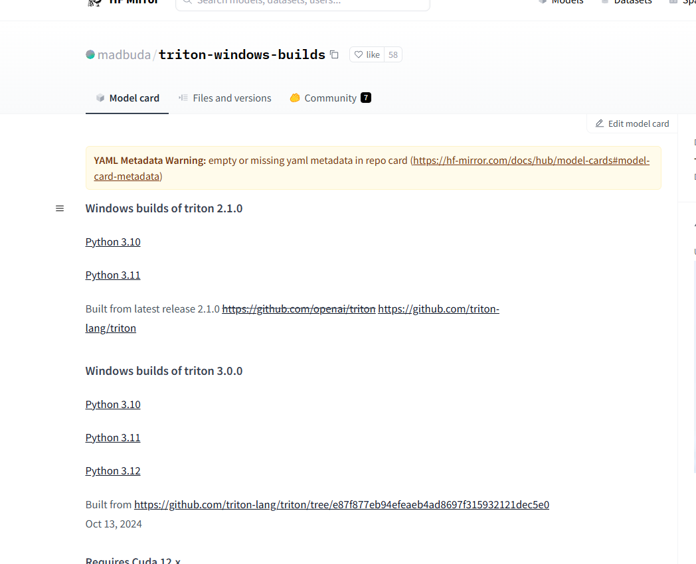
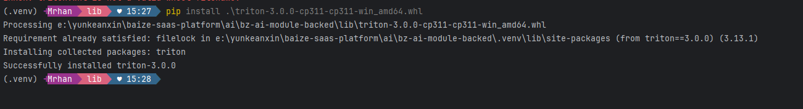

> 前言:  
> 最近公司的产品需要与LLMs能力结合，模型我们采用的是阿里的同义千问(qwen2.5 32B - Instruct)

使用 vllm 在windows上使用时，出现的如下错误：

1. 依赖安装(正常)
  ```bash
  pip install torch torchvision torchaudio --index-url https://download.pytorch.org/whl/cu124
  pip install tensorflow transformers vllm 
  ```
2. 运行`vllm` 报错

```bash
vllm
```
执行报错,并且尝试安装：
```bash
pip install vllm
```


> 这是因为 pypi 中的 triton 中没有适用于 Python 的版本。目前基本只支持linux版本

## 什么是 `Triton`

>项目地址: https://github.com/triton-lang/triton

Triton 是一种用于编写高效自定义深度学习原语的语言和编译器。 Triton 的目标是提供一个开源环境，以比 CUDA 更高的生产率快速编写代码，而且比其他现有 DSL 具有更高的灵活性。

**解决方法：**

1. 在 HuggingFace 上下载 triton 的 Windows 包：https://huggingface.co/madbuda/triton-windows-builds
  
2. 下载后使用pip安装
  ```bash
    pip install triton-2.1.0-cp311-cp311-win_amd64.whl
  ```
  注意：只支持 3.10 - 3.12
  
  > 截图中安装的是 3.0.0 是有问题的，2.1.0 可以安装

3. 再次运行 `vllm` 时发现报错:
  再次报错：找不到模块 `uvloop`

### uvloop 
> https://github.com/MagicStack/uvloop
uvloop 是内置 asyncio 事件循环的快速替代品。uvloop 在 Cython 中实现，并在底层使用 libuv

这里，解决办法：从源码编译安装

