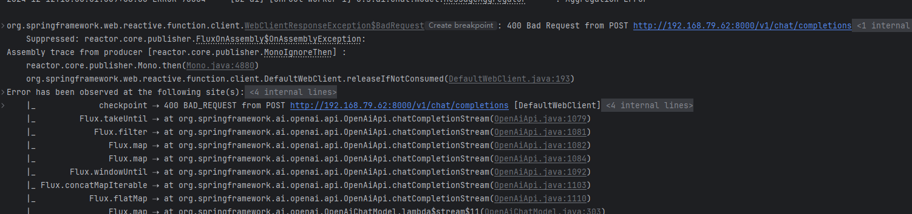

使用SpringAI 对接vllm 服务

1. 启动服务
  
    使用 `vllm.entrypoints.openai.api_server` 来启动一个兼容openai 接口的服务
    ``` bash
      python -m vllm.entrypoints.openai.api_server --served-model-name Qwen2.5-7B-Instruct --model /root/modules/Qwen2.5-7B-Instruct --max-model-len 4096
    ```
   2. 对接Spring AI
    
       使用SpringAI提供对接OpenAI的模块对接VLLM
       ```xml
       <dependency>
           <groupId>org.springframework.ai</groupId>
           <artifactId>spring-ai-openai-spring-boot-starter</artifactId>
       </dependency>
       ```
       配置：
       ```yaml
       spring:
        ai:
         openai:
           api-key: none
           chat:
             base-url: http://192.168.79.62:8000
             options:
               model: Qwen2.5-7B-Instruct
             enabled: true
       ```
      代码：
      ```java
      private OpenAiChatModel openAiChatModel
      Prompt prompt = new Prompt(Arrays.asList(new UserMessage("你是谁")));
      System.out.println(openAiChatModel.stream(prompt).blockLast().getResult().getOutput().getContent());
      ```

## 坑

1. 使用 `model.stream()` 使用Stream 类型来获取响应，则会报错 400
  
    使用`model.call()` 是可以正常调用的，但是使用`stream()` 则报错400
    
    经过抓包发现，使用 `stream` 函数时发送的http请求如下:
    ```http request
    POST /v1/chat/completions HTTP/1.1
    Connection: Upgrade, HTTP2-Settings
    Host: 192.168.79.62:8000
    HTTP2-Settings: AAEAAEAAAAIAAAABAAMAAABkAAQBAAAAAAUAAEAA
    Upgrade: h2c
    User-Agent: Java-http-client/17
    Accept: */*
    Content-Type: application/json
    
    {"messages":[{"content":"你好","role":"user"}],"model":"Qwen2.5-7B-Instruct","stream":true,"temperature":0.7}
    ```
    可以看到，客户端期望使用HTTP2进行请求，但是 `vllm`好像不支持（暂未调研），导致400错误，但是如果使用 http1是正常的。那么接下来就需要想办法让
    Spring AI的客户端。
      
    在Spring Configuration 配置中添加如下Bean 即可
   ```
    @Bean
    public ClientHttpConnector clientHttpConnector() {
        return new JdkClientHttpConnector(HttpClient.newBuilder()
                .version(HttpClient.Version.HTTP_1_1)
                .build());
    }
   ```
    
    
