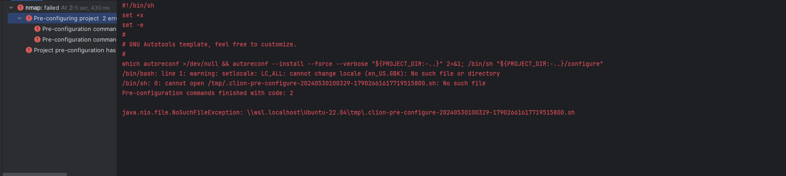

> 由于业务需要，我们需要对NMap 这一强大扫描器做一些定制化的开发。但难受的是我们本身
> 使用的系统是Windows 系统，好在现在Windows 支持 WSL 子系统，通过WSL 来构建。

## 前期准备：

**环境:**
1. 开发工具: JetBrains Clion
2. 操作系统： Windows 11、Ubuntu-22.04-WSL
3. 构建项目:  Nmap

```shell
  git clone https://github.com/nmap/nmap.git
```

下载源码后通过 `Clion` 打开项目。

## 项目开始:



好的，打开项目之后，会识别是Makefile项目，上来就是当头一棒！

