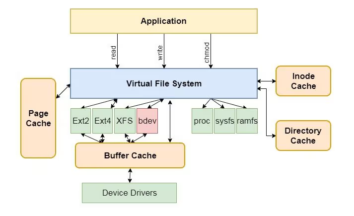
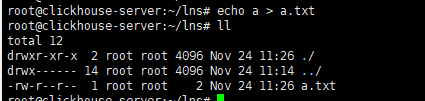
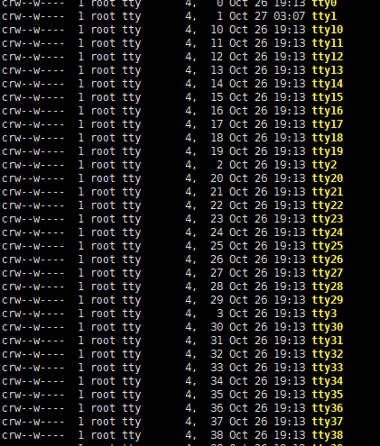

## 文件类型

### 普通文件类型

Linux中最多的一种文件类型, 包括：
- 纯文本文件(ASCII)
- 二进制文件(binary)
- 数据格式的文件(data);
- 各种压缩文件。

通常第第一个属性为 `-`: `-rw-r--r--` 。

###  目录文件类型

linux中，它的思想是一切皆是文件，目录文件也就是Windows中的目录，也就是能用 cd 命令进入的。第一个属性为 `d`，例如 `drwxr-xr-x`。

### 字符设备文件

即串行端口的接口设备，例如键盘、鼠标等等。第一个属性为 `c`。

字符(`char`)设备是个能够像字节流(`类似文件`)一样被访问的设备，由字符设备驱动程序来实现这种特性。
字符设备驱动程序通常至少要实现`open`、`close`、`read`和`write`的系统调用。
字符终端(`/dev/console`)和串口(`/dev/ttyS0`以及类似设备)就是两个字符设备，它们能很好的说明`流`这种抽象概念。
字符设备可以通过文件节点来访问，比如`/dev/tty1`和`/dev/lp0`等。
这些设备文件和普通文件之间的唯一差别在于对普通文件的访问可以`前后移动访问位置`，而大多数字符设备是一个只能`顺序访问的数据通道`。
然而，也存在具有`数据区特性的字符设备`，访问它们时`可前后移动访问位置`。
例如`framebuffer`就是这样的一个设备，app可以用`mmap`或`lseek`访问抓取的整个图像。

设备文件是没有文件大小的，取而代之的是两个号码：主设备号5 +次设备号1 。

**Linux 特殊字符设备文件:**

- `/dev/null`: 可无限往里输出数据，你可以认为是一个黑洞
- `/dev/full`: 它在读取时会读取到连续的`NUL（零值）`字节流，而在写入的时候，会返回磁盘空间已满的结果，可用来测试磁盘满的情况
- `/dev/zero`: 和`/dev/null`类似，向其中写入时会丢弃所有数据，但是读取时，会产生`NUL（零值）`字节流
- `/dev/random`: 可以提供随机数据流，它保证数据的随机性，但是读取时会造成等待, 稍过会才会出现数据，为了便于查看，我们利用od命令查看其十六进制内容。
- `/dev/urandom`: 从名字就可以看出来，是用来产生随机数据的。它的产生速度很快，但是数据的随机性不如`/dev/random`
- `/dev/pts`: 是远程登陆(telnet,ssh等)后创建的控制台设备文件所在的目录。

### 块设备文件

即存储数据以供系统存取的接口设备，简单而言就是硬盘。例如一号硬盘的代码是 `/dev/hda1` 等文件。第一个属性为 `b`。
在Linux系统中，块设备文件是用来表示块设备的特殊文件。块设备是一种存储数据的设备，数据以固定大小的块（通常是512字节或4KB）进行读取和写入。硬盘驱动器是块设备的一个常见例子。

在Linux中，块设备文件通常位于`/dev`目录下。以下是一些常见的块设备文件：
硬盘驱动器：

- IDE硬盘：`/dev/hd[a-d]`
- SATA硬盘：`/dev/sd[a-z]`
- SCSI硬盘：`/dev/sd[a-z]`
- NVMe硬盘：`/dev/nvme0n1`

分区：

硬盘分区通常通过在设备名称后加上数字来表示，例如，第一个分区可以是`/dev/sda1`。

- 软盘驱动器：

`/dev/fd0` 是第一个软盘驱动器。

- USB设备：

USB设备通常位于`/dev/sd[a-z]` 中，具体取决于连接的顺序。

- RAID设备：

软RAID设备可以使用 `/dev/md0`, `/dev/md1` 等表示。

- LVM（逻辑卷管理）设备：

LVM设备可以在`/dev/mapper/`目录下找到，例如 `/dev/mapper/vg_name-lv_name`。

- 循环设备：

循环设备是通过`/dev/loopX` 表示的，其中X是数字。
循环设备（Loop device）是Linux系统中的一种特殊块设备，允许将一个文件当作块设备来使用。
这样可以在文件和块设备之间建立关联，使得可以通过块设备的接口来访问文件中的数据。
循环设备的主要用途之一是支持文件系统镜像的挂载，或者创建和管理虚拟磁盘

### 套接字文件

这类文件通常用在网络数据连接。可以启动一个程序来监听客户端的要求，客户端就可以通过套接字来进行数据通信。第一个属性为 `s`，最常在 `/var/run` 目录中看到这种文件类型。

### 管道文件

FIFO也是一种特殊的文件类型，它主要的目的是，解决多个程序同时存取一个文件所造成的错误。FIFO是first-in-first-out(先进先出)的缩写。第一个属性为 `p`。

### 链接文件

类似Windows下面的快捷方式。第一个属性为 `l`，例如 `lrwxrwxrwx`。
在Linux系统中，链接文件（Link）是一种允许多个文件名引用同一份数据块的机制
有两种主要类型的链接：
- 硬链接（Hard Link）  
  硬链接是文件系统中的一种机制，它允许一个文件有多个文件名，这些文件名都指向相同的数据块。硬链接与原始文件没有区别，它们只是文件系统目录中的多个条目，指向相同的索引节点（`Inode`）。在硬链接中，删除一个文件并不会影响其他链接，直到所有链接都被删除，数据块才会被释放
- 符号链接（Symbolic Link，也称为软链接或`symlink`  
  符号链接是指向另一个文件的特殊文件，它包含一个指向目标文件的路径。符号链接更加灵活，因为它们可以跨越文件系统边界，也可以指向目录。符号链接在文件系统中保留一个独立的索引节点，而不是与原始文件共享

## 参考

- [Linux之字符设备文件](https://blog.csdn.net/weixin_45063703/article/details/117419381)
- 
