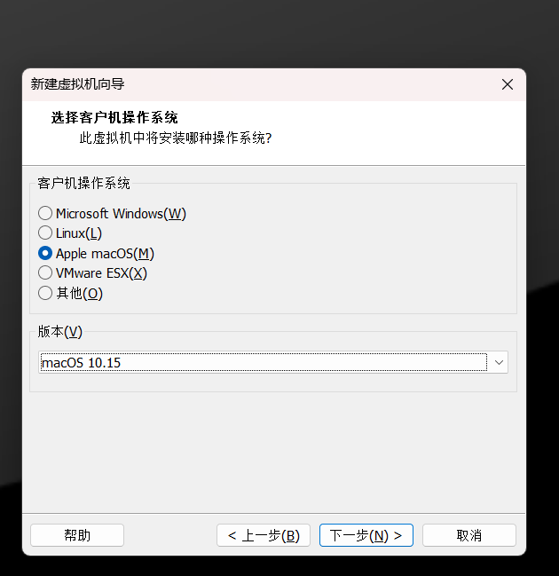
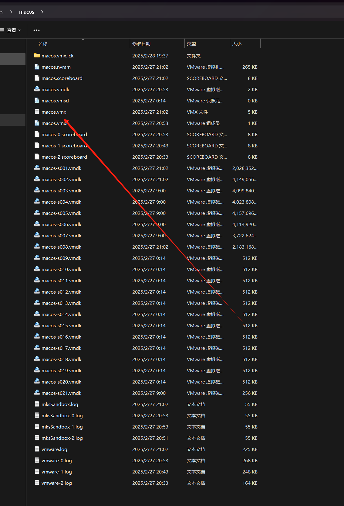
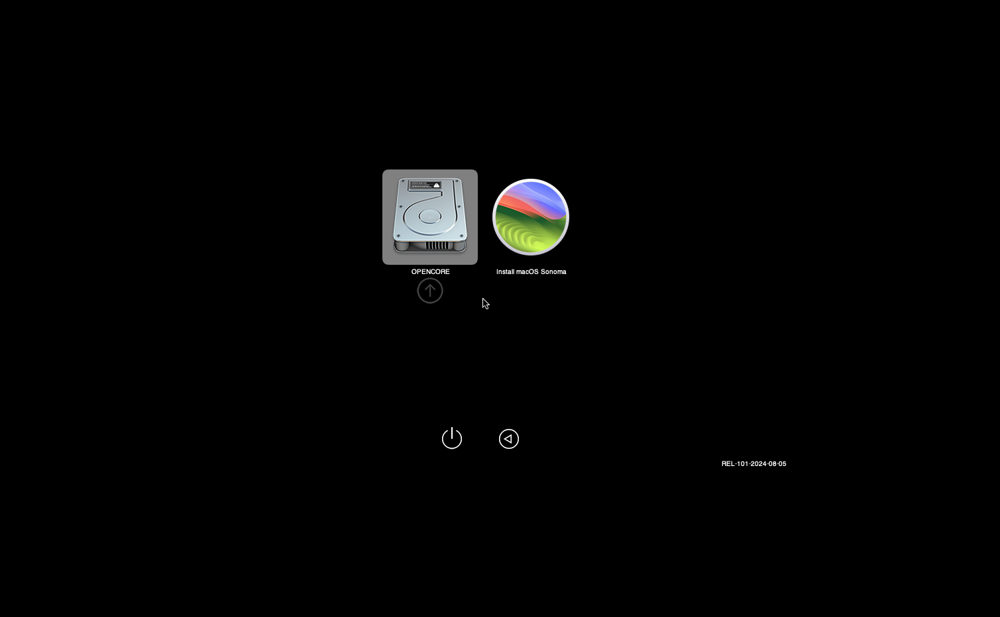

AMD CPU 安装 Macos 15。AMD 平台在MacOS 支持上是比较差的。那么如何安装呢？

> 前提：VMWare WorkerStation Pro 17 默认是不支持安装MacOS 系统的，所以，需要使用 Unloker 进行解锁。Google即可查得到 本文不过多介绍

## Macos 10 之前版本


MacOS 10之前相对比较简单。可以直接按照正常创建虚拟机的方式进行创建即可。



创建完成后，需要编辑虚拟机配置文件 `*.vmx`

添加如下内容:
```properties
smc.version = "0"
cpuid.0.eax = "0000:0000:0000:0000:0000:0000:0000:1011"
cpuid.0.ebx = "0111:0101:0110:1110:0110:0101:0100:0111"
cpuid.0.ecx = "0110:1100:0110:0101:0111:0100:0110:1110"
cpuid.0.edx = "0100:1001:0110:0101:0110:1110:0110:1001"
cpuid.1.eax = "0000:0000:0000:0001:0000:0110:0111:0001"
cpuid.1.ebx = "0000:0010:0000:0001:0000:1000:0000:0000"
cpuid.1.ecx = "1000:0010:1001:1000:0010:0010:0000:0011"
cpuid.1.edx = "0000:0111:1000:1011:1111:1011:1111:1111"
smbios.reflectHost = "TRUE"
hw.model = "MacBookPro14,3"
board-id = "Mac-551B86E5744E2388"
```
注意，还需要修改兼容性：


将 `virtualHW.version = "21"` 修改为： `virtualHW.version = "16"`


## MacOS 15

> MacOS 10 之后的版本相对比较麻烦，不过 MacOS 11可以试一下前面的方法。

MacOS 15 需要基于 OpenCore 插件来安装，对内核要求相对比较高。

流程前：
准备OpenCore 镜像：


命名规则: 
- `macOs_Opencore_1.0.1_16_cores.zip`: 虚拟机必须采用 16核
- `macOs_Opencore_1.0.1_8_cores.zip`: 虚拟机必须采用 8核
- `macOs_Opencore_1.0.1_4_cores.zip`: 虚拟机必须采用 4核

> 注意：这个是插件内提供的，并不是通过改文件名可以变动的。

### 流程

> 前面流程都一致，后面创建虚拟机后开始不一致的流程。

1. 导入OpenCore 镜像

  

  选择解压出来的 Opencore 镜像

  

  特别注意，必须进行转换，否则将无法使用（尝试了N次）

  

2. 调整硬盘位

  

  调整到第0位

  

3. 启动虚拟机
  
  点击 Install MacOS Sonoma
  
  

等待滚动，正常安装即可
