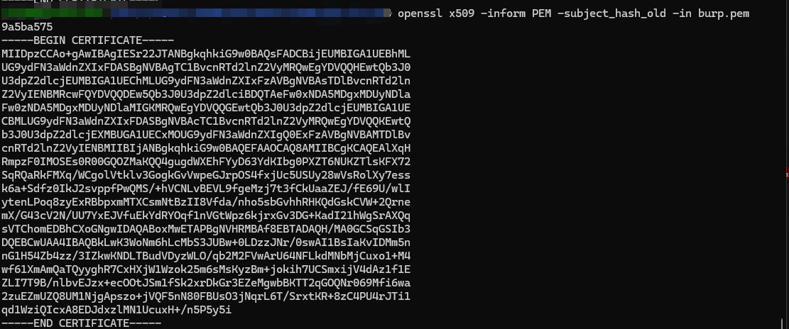
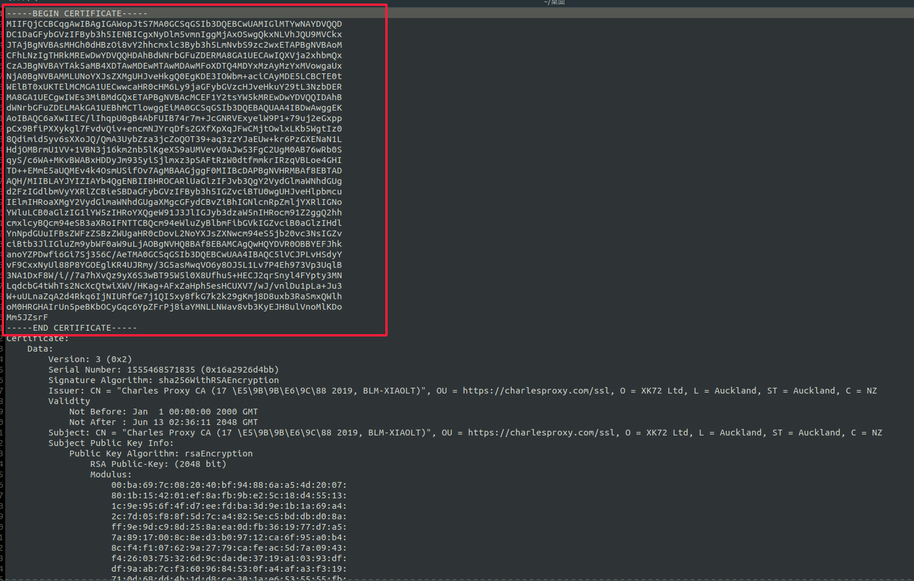

> 环境依赖:

1. 机器需要: `root` 权限


## 准备证书:

计算证书 `hash`

```shell
  # .cer格式证书
  openssl x509 -inform DER -subject_hash_old -in 证书文件.cer
  # .pem格式证书
  openssl x509 -inform PEM -subject_hash_old -in  证书文件.pem
```
计算结果:



## 生成系统系统预设格式证书文件

```shell
  # .cer格式
  openssl x509 -inform DER -text -in xxx.cer > {hash}.0
  # .pem格式
  openssl x509 -inform PEM -text -in xxx.pem > {hash}.0
```
最后编辑一下输出的文件，把 -----BEGIN CERTIFICATE----- 到最后的这部分移动到开头。结果如下




## 上传证书

执行:
1. `adb push 0dd2455e.0 /sdcard`
2. `adb shell`
3. `su`
4. `mount -o remount,rw /system` / `mount -o rw,remount /system`
5. `cp /sdcard/0dd2455e.0 /system/etc/security/cacerts/`
6. `chmod 644 /system/etc/security/cacerts/0dd2455e.0`


## 参考

  - [安卓手机添加系统证书方法(HTTPS抓包)](https://www.cnblogs.com/zj420255586/p/14652194.html)
