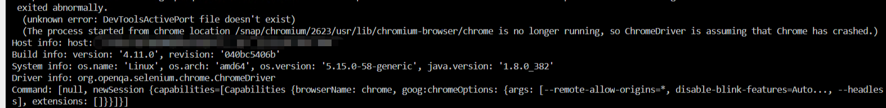
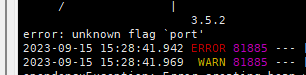

```bash
  sudo snap install chromium
  # 安装成功后会在
  /snap/bin/chrome
```

## Selenium 使用问题

### DevToolsActivePort file doesn't exist



```java
  ChromeOptions options = new ChromeOptions();
  options.addArguments("disable-blink-features=AutomationControlled");
  options.addArguments("--headless");
  options.addArguments("--no-sandbox");
  ChromeDriver webDriver = new ChromeDriver(options);
  webDriver.get("https://www.baidu.com");
  System.out.println(webDriver.getCurrentUrl());
  System.out.println(webDriver.findElement(By.tagName("body")).getText());
```

解决方案:

1. 查看运行的权限: 不可以使用 `root` 用户运行
2. 如果必须要 `root` 可以添加 `--no-sandbox` 参数


### 启动打印： `error: unknown flag `port'`



解决办法:
定义一个 `bash`脚本来启动
```bash
  #!/bin/bash
  chromium.chromedriver $@
```
Java 配置Chromium 执行文件

```java
  System.setProperty("webdriver.chrome.driver", bashScriptFile);
  ChromeOptions options = new ChromeOptions();
  options.addArguments("disable-blink-features=AutomationControlled");
  options.addArguments("--headless");
  options.addArguments("--no-sandbox");
  ChromeDriver webDriver = new ChromeDriver(options);
  webDriver.get("https://www.baidu.com");
  System.out.println(webDriver.getCurrentUrl());
  System.out.println(webDriver.findElement(By.tagName("body")).getText());

```
