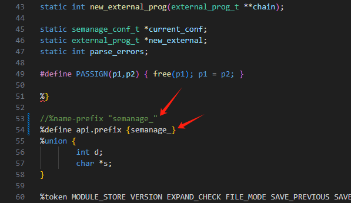

> 最近来了这么一个需求，我们的系统需要提供安装包，方便售前人员直接安装到客户系统中。
> 这没什么问题，毕竟，一键安装更方便，更不容易出错（比起让售前手动配置系统来说）。

那么这时候就有一个问题：我们的程序依赖了一个非常庞大的中间组件系统，并且此系统只提供容器镜像，没有任何安装程序。
当然，我们也不希望客户知道我们依赖了这个容器。

想到的解决方案如下：

1. 我们的程序直接解压
2. 对于依赖的镜像，使用podman 来运行，并且如何客户自身如果安装的有`podman`不能存在影响。

于是，我们的 `podman` 就想着通过静态编译重新打包一个不依赖任何 `.so`库的程序，避免在不同环境下依赖的问题。

## Podman 源码编译

- 依赖: 一下是作者编译时候使用的环境
  - `make: 4.3`
  - `golang: 1.21`
  - `pkg-config: 0.29.2`
  - `containers/conmon: 最新版`
  - `gcc`
  - `shadow-maint/shadow`

### 1. clone 源码

```bash
  git clone https://github.com/containers/podman
  cd podman
  # EXTRA_LDFLAGS 是 Makefile 中引用外部的一个环境变量
  # -extldflags=-static GO的linker参数
  EXTRA_LDFLAGS="-extldflags=-static" make
```
编译成功后可以看到生成了一个 `bin` 目录，并且包含了如下程序


### 2. 启动?

```bash
  ./bin/podman system service
```


呕吼，没启动起来，报错了！

### 3. 编译 `conmon`: An OCI container runtime monitor.
[conmon link](https://github.com/containers/conmon.git)
```bash
  git clone https://github.com/containers/conmon.git
  # LDFLAGS 链接参数 -static 使用静态库进行链接 
  LDFLAGS="-static" make
```


### 4. 再次启动!

```bash
  cp ../conmon/bin/conmon .
  ./podman system service --conmon=./conmon
```

哦吼，再次报错, 这次缺少 newuidmap, 那么下载这些工具

### 5. 编译 `shadow`
  
   1. 编译 `https://github.com/pexip/os-libsemanage.git` shadow 依赖，但是apt 安装的只有是动态库 [看错了，次步骤可选]
      - 依赖:
        - bison: 新版本
   ```bash
     git clone https://github.com/pexip/os-libsemanage.git 
     make
     sudo make install
   ```
   编译报错:
   
   
   

    解决方式:
   
    如果是新版 bison 不支持 `%name_prefix`, 替换为: `%define api.prefix {}`
   
    
    修改Makefile, `-o`参数貌似无法输出目标文件，默认生产的是 `lex.semanage_.c` 手动重命名为目标文件

    
    
    由于找不到这个函数定义，代码中也找不到，所以就给实现了一个默认的定义 `conf-parse.y`
    
   2. 编译: `https://github.com/SELinuxProject/selinux`  
   次模块内部也会存在上面第一步骤类似的问题
   ```shell
      wget https://github.com/SELinuxProject/selinux/archive/refs/tags/3.6.zip
      unzip selinux-3.6.zip
      cd selinux-3.6 && make install
    
   ```
    

```bash
  git clone https://github.com/shadow-maint/shadow.git
  mkdir build
  cd build
  ../autogen.sh --libdir=/usr
  make
```
> 注意: 执行 autogen 缺少依赖，根据提示安装即可，2. 提供make 编译时，提示缺少 `tl.po` `xx.po` 文件，那么只需要在
> po/LINGUAS 中删除即可


> 编译静态程序需要 在 `autogen.sh` 中加上 CFLAGS="--static"

> 如果出现这样的错误: `/usr/bin/ld: (.text+0x6b1): undefined reference to `SHA512Update'` 修改一下 链接顺序


文件: `build/src/Makefile`
正则:` (\$\([a-z|_]*_LDADD\)?) (\$\(LIBS\))` => `$2 $1`


这样的错误的话直接修改对于`src/Makefile`的对于目标配置，例如:


或者修改文件 `build/libsubid/libsubid.la`


或者重新编译 `https://github.com/guillemj/libbsd.git`

### 6. 累了不写了，看流程吧

#### 6.1 编译: `https://github.com/containers/netavark.git`

```shell
  git clone https://github.com/containers/netavark.git
  rustup target add x86_64-unknown-linux-musl
  rustup toolchain add nightly-x86_64-unknown-linux-gnu
  rustup target add x86_64-unknown-linux-musl --toolchain=nightly
  sudo apt install musl-tools -y
  make
```


#### 6.2 下载: `crun`

[crun](https://github.com/containers/crun/releases)


经过以上步骤，一个完整的静态 `podman` 就打包好了

> 使用上还是有些坑，例如配置: `conmon`、`crun` `newuidmap` `netavark`

## 参考

  - [https://github.com/SELinuxProject/selinux](https://github.com/SELinuxProject/selinux)
