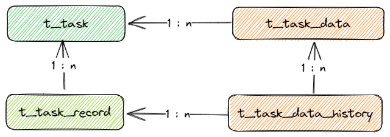
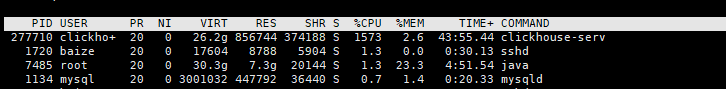

问题是这样的，线上有个任务系统，这个系统会主动采集大量数据进行处理分析。采集的范围和目标是可根据用户实际需要而发生改变的。系统上的采集任务支持周期性定时采集。
将每一次的数据采集给存放到数据库中，将所有采集的数据进行汇总暂时，例如: `两次采集的目标一样，进行更新，展示最后一条`
。目前使用的是`Clickhouse` 作为数据库的存储方案。

# 1. 现有方案



```sql

create table t_task
(
  id          UInt64 comment '任务ID',
  name        String comment '任务名称',
  create_time datetime comment '创建时间'
) engine MergeTree
    primary key id
    order by (id, create_time);

create table t_task_record
(
  id          UInt64 comment '记录ID',
  task_id     UInt64 comment '任务ID',
  create_time datetime comment '创建时间'
) engine MergeTree
    primary key id
    order by (id, create_time);

create table t_task_data
(
  id          UInt64 comment '数据ID',
  task_id     UInt64 comment '任务ID',
  title        String comment '数据title',
  data        String comment '任务数据',
  create_time datetime comment '创建时间'
) engine MergeTree
      primary key id
      order by (id, create_time);

create table t_task_data_history
(
  id          UInt64 comment '记录ID',
  record_id   UInt64 comment '任务记录ID',
  data_id     UInt64 comment '数据主表记录ID',
  task_id     UInt64 comment '任务ID',
  data        String comment '任务数据',
  create_time datetime comment '创建时间'
) engine MergeTree
      primary key id
      order by (id, create_time);
```
现有方案是把数据分为两层: `汇总层`, `记录层`。在处理数据的过程中，会把数据的每次记录给保存到`记录层`表中，
多次的数据采集，汇总到`汇总层`表中。既然是`汇总层`那么里面的数据就需要去除重复，
所以在每次处理数据的过程中都需要进行查询`t_task_data`，判断表中是否已经存在相同的数据记录了，
如果存在则进行更新，如果不存在则进行保存。
```javascript
/**
 * 业务伪代码
 * @param dataModel 采集到的数据 
 * @param task  关联的任务
 * @param record 关联的扫描记录
 */
function process_data(dataModel, task, record) {
    // 查询数据库中是否存在记录
    let dbData = taskDataMapper.query('where title={title} and task_id={task_id}').one();
    // 如果存在则修改
    // 如果不存在则新增
    if (dbData) {
        dbData.title = dataModel.title;
        dbData.data = dataModel.data;
        // sql: alter table t_task_data update title={title}, data={data} where id = {id}
        taskDataMapper.updateById(dbData);
    } else {
        // 生成ID
        dataModel.id = Id.genId();
        dataModel.task_id = task.id;
        dataModel.create_time = now();
        taskDataMapper.save(dataModel);
    }
    // 保存记录
    let dataHistoryModel = {id: Id.genId(), task_id: task.id, record_id: record.id, create_time: now()};
    dataHistoryModel.title = dataModel.title;
    dataHistoryModel.data = dataModel.data;
    taskDataRecordMapper.save(dataHistoryModel);
}
```
以上是使用`javascript` 实现的伪业务代码。实际真实情况要比以上代码复炸得多。可以看到，如果同一个任务下同一个`title` 数据存在，则我们需要对数据库数据进行修改。  

---
`Clickhouse` 是一个用于在线分析处理(OLAP)的`列式数据库管理系统`, 数据是按照列的方式进行存储的和MySQL不同，MySQL 是行式存储的数据库系统。

不同的数据存储方式适用不同的业务场景，数据访问的场景包括：进行了何种查询、多久查询一次以及各类查询的比例；每种类型的查询(行、列和字节)读取多少数据；读取数据和更新之间的关系；使用的数据集大小以及如何使用本地的数据集；是否使用事务,以及它们是如何进行隔离的；数据的复制机制与数据的完整性要求；每种类型的查询要求的延迟与吞吐量等等。

系统负载越高，依据使用场景进行定制化就越重要，并且定制将会变的越精细。没有一个系统能够同时适用所有不同的业务场景。如果系统适用于广泛的场景，在负载高的情况下，要兼顾所有的场景，那么将不得不做出选择。是要平衡还是要效率？

---
回到正题，`Clickhouse` 是一个对于查询有着很高性能 ([link][clickhouse_performance])，
对于写入clickhouse 建议`批量写入` 每次写入不少于`1000` 条数据。
在`Clickhouse` 修改和删除数据是一个非常重量级的操作([delete][clickhouse_alter_delete] / [update][clickhouse_alter_update])。
强烈不建议频繁对数据进行修改，`Clickhouse` 基于重写数据块的方式来实现数据的更新和删除([mutations][clickhouse_alter_mutations])。

**问题**

基于上面的一些信息可以发现，如果采集的数据了非常大的情况下，并且数据重复率很高的时候，会造成非常多的修改命令。
会产生大量`mutatuions`，会导致非常多的数据块进行`重建`, 导致`IO/CPU`压力飙升。

导致线上系统查询缓慢。

# 2. 基于表引擎方案

由于业务原因导致，我们可能存在大量的`更新方案`，但是在`Clickhouse` 中更新是非常昂贵的，
这时候可以使用`Clickhouse` 自己的解决方案: 
- `ReplacingMergeTree`: 替换合并树 ([link][clickhouse_table_engine_replacingmergetree])
- `CollapsingMergeTree`: 折叠合并树 ([link][clickhouse_table_engine_collapsingmergetree])
- `VersionCollapsingMergeTree`: 版本折叠合并树 ([link][clickhouse_table_versionedcollapsingmergetree])

以上这三种表引擎可以达到我们所想要的效果。例如: 数据更新、删除、新增。

## 2.1. ReplacingMergeTree

```sql
CREATE TABLE [IF NOT EXISTS] [db.]table_name [ON CLUSTER cluster]
(
    name1 [type1] [DEFAULT|MATERIALIZED|ALIAS expr1],
    name2 [type2] [DEFAULT|MATERIALIZED|ALIAS expr2],
    ...
) ENGINE = ReplacingMergeTree([ver])
[PARTITION BY expr]
[ORDER BY expr]
[PRIMARY KEY expr]
[SAMPLE BY expr]
[SETTINGS name=value, ...]

```

`ReplacingMergeTree` 是`MergeTree` 家族中的引擎，该引擎与MergeTree 的不同之处在于它会删除具有`相同排序键值`（ORDER BY表部分，而不是PRIMARY KEY）的重复条目。
`ReplacingMergeTree` 会在数据的合并期间进行删除重复的数据，但是合并数据时间是无法确定的，是由clickhouse 后台进行控制的。
可以通过执行 `OPTIMIZE TABLE table_name ` 来手动触发合并。但是不建议频繁使用这种方式 因为`OPTIMIZE`操作将读取和写入大量数据。

## 2.1. CollapsingMergeTree

```sql
CREATE TABLE [IF NOT EXISTS] [db.]table_name [ON CLUSTER cluster]
(
    name1 [type1] [DEFAULT|MATERIALIZED|ALIAS expr1],
    name2 [type2] [DEFAULT|MATERIALIZED|ALIAS expr2],
    ...
) ENGINE = CollapsingMergeTree(sign)
[PARTITION BY expr]
[ORDER BY expr]
[SAMPLE BY expr]
[SETTINGS name=value, ...]
```

`CollapsingMergeTree`也是`MergeTree` 家住中的引擎，在数据合并过程中加入了行折叠的逻辑。
在`CollapsingMergeTree`引擎中，添加以一个行数据的状态字段`sign`, 这个字段取值为：`-1` `1`, 代表着此行是`状态行` 还是`取消行`

有效行：此行数据是有效的
取消行：用于取消有效行数据的有效性。在数据合并期间，如果一个`状态行` 对应 有一个 `取消行` 则数据会进行删除

现有数据:

| id  | name | sign |
|-----|------|------|
| 1   | 小王   | 1    |

**如果我需要更新小王的数据:**

```sql

insert into user(id, name, sign) values (1, '', -1), (1, '小李', 1);
```
执行完成后数据如下:

| id  | name | sign |
|-----|------|------|
| 1   | 小王   | 1    |
| 1   |      | -1   |
| 1   | 小李   | 1    |

等到数据合并期间会把前两条记录折叠删除

**如果需要删除数据**

```sql
insert into user(id, name, sign) values (1, '', -1);
```

插入一条取消行，取消有效行的数据，让其发生折叠并且删除

| id  | name | sign |
|-----|------|------|
| 1   | 小王   | 1    |
| 1   |      | -1   |

**如果需要查询最新数据**

由于数据的折叠和删除发生在未知时间，所以并不会立马删除，从而导致重复数据的产生。此时查询就需要使用 `group by` 来对数据进行过滤

```sql
  select id, anyLast(name) name group by id having sum(sign) > 0
```

## 2.1. VersionedCollapsingMergeTree

```sql
CREATE TABLE [IF NOT EXISTS] [db.]table_name [ON CLUSTER cluster]
(
    name1 [type1] [DEFAULT|MATERIALIZED|ALIAS expr1],
    name2 [type2] [DEFAULT|MATERIALIZED|ALIAS expr2],
    ...
) ENGINE = VersionedCollapsingMergeTree(sign, version)
[PARTITION BY expr]
[ORDER BY expr]
[SAMPLE BY expr]
[SETTINGS name=value, ...]

```

`VersionedCollapsingMergeTree` 继承于 `CollapsingMergeTree`, 此引擎允许快速写入状态平凡变化的记录
使用 `version` 字段来标识对象的变化位置。`VersionCollapsingMergeTree`使用不同的折叠算法，允许使用多线程以任意顺序插入数据

- `sign: Int8` : 具有行类型的列的名称：1是“状态”行，-1是“取消”行。
- `version: UInt*` : 带有对象状态版本的列的名称。

# 3. 总结

使用 clickhouse 的过程中，根据不同业务要选择合适的表引擎。MergeTree 系列有很多表引擎可以选择：

- `MergeTree`: MergeTree表引擎主要用于海量数据分析，支持数据分区、存储有序、主键索引、稀疏索引、数据TTL等
- `ReplacingMergeTree`: 为了解决MergeTree相同主键无法去重的问题，ClickHouse提供了ReplacingMergeTree引擎，用来做去重。
- `CollapsingMergeTree`: ClickHouse实现了CollapsingMergeTree来消除ReplacingMergeTree的限制。该引擎要求在建表语句中指定一个标记列Sign，
后台Compaction时会将主键相同、Sign相反的行进行折叠，也即删除。
- `VersionedCollapsingMergeTree`: 为了解决CollapsingMergeTree乱序写入情况下无法正常折叠问题，VersionedCollapsingMergeTree表引擎在建表语句中新增了一列Version，用于在乱序情况下记录状态行与取消行的对应关系。主键相同，且Version相同、Sign相反的行，在Compaction时会被删除。
- `SummingMergeTree`: ClickHouse通过SummingMergeTree来支持对主键列进行预先聚合。在后台Compaction时，会将主键相同的多行进行sum求和，然后使用一行数据取而代之，从而大幅度降低存储空间占用，提升聚合计算性能。
- `AggregatingMergeTree`: AggregatingMergeTree也是预先聚合引擎的一种，用于提升聚合计算的性能。与SummingMergeTree的区别在于：SummingMergeTree对非主键列进行sum聚合，而AggregatingMergeTree则可以指定各种聚合函数。

除了 MergeTree 之外，clickhouse 还提供了 `Replicated`，`Distributed`等高级表引擎

[clickhouse_performance]: https://clickhouse.com/docs/zh/introduction/performance
[clickhouse_alter_update]: https://clickhouse.com/docs/zh/sql-reference/statements/alter/update
[clickhouse_alter_delete]: https://clickhouse.com/docs/zh/sql-reference/statements/alter/delete
[clickhouse_alter_mutations]: https://clickhouse.com/docs/zh/sql-reference/statements/alter/#alter-mutations
[clickhouse_table_engine_replacingmergetree]: https://clickhouse.com/docs/en/engines/table-engines/mergetree-family/replacingmergetree
[clickhouse_table_engine_collapsingmergetree]: https://clickhouse.com/docs/en/engines/table-engines/mergetree-family/collapsingmergetree
[clickhouse_table_versionedcollapsingmergetree]: https://clickhouse.com/docs/en/engines/table-engines/mergetree-family/versionedcollapsingmergetree
