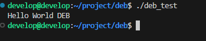

## 1. 通过命令制作 `.deb 安装包`

> 我们通常在使用Debian系的Linux系统时，常常会遇到一些deb格式安装包。我们也知道，使用dpkg命令即可安装。
当然，也会下载到一些软件是压缩包，就没那么方便了。我们能不能把它自己打包成deb安装包呢？


## 1.1 认识deb安装包结构

> 在制作安装包之前，我们认识一下deb包的内容：


这是我要打包的内容，可见除了`DEBIAN`文件夹，其余都是应用程序文件，这里其余部分的目录模拟了安装目录（看起来和安装完成后根目录里面对应内容结构一致），这是因为deb安装包安装就是把内容释放到了根目录/下。

`DEBIAN`文件夹中必须有`control`文件，表示安装包基本信息。
除此之外，其中还可以有：
- `preinst` 软件安装之前会执行的脚本
- `postinst` 软件安装完成后执行的脚本
- `prerm` 软件卸载前会执行的脚本
- `postrm` 软件卸载后会执行的脚本

这四个脚本非必须，如果有，这四个脚本文件必须要有可执行权限。

## 1.2 开始制作安装包



可以执行文件: `deb_test`, 是一个由执行权限的 sh 脚本
```bash
  #!/bin/bash

  echo "Hello World DEB"
```

### 1.2.1 创建 `DEBIAN` 目录并在里面创建、编写 `control`文件

`control` 文件 

```makefile
  Package: debtest
  Version: 1.0.0
  Section: test
  Priority: optional
  Architecture: amd64
  Installed-Size: 218600
  Maintainer: RickSanchez<rick@163.com>
  Provides: Rick
  Description: 打包测试的安装包
  
```

上述字段意义如下：

- `Package`: 包名
- `Version`: 版本号
- `Section`: 软件的类别，可以是utils、net、mail、text、devel等等
- `Priority`: 软件对于系统的重要程度，如required、standard、 optional、extra等等
- `Architecture`: 架构，32位软件填写i386，64位软件填写amd64，如果是既能在32位系统运行又能在64为系统运行可以填写all
- `Installed-Size`: 安装后大小，单位为kb
- `Maintainer`: 维护者，为维护者名<邮箱>的形式
- `Provides`: 供应者
- `Description`: 描述

上面的字段是必须字段或者常用字段，除此之外，`control`文件还可以有以下字段，以下字段非必须，按需加入：

- `Essential`: 申明是否是系统最基本的软件包，值为yes或者no，如果是的话，这就表明该软件是维持系统稳定和正常运行的软件包，不允许任何形式的卸载
- `Depends`: 软件所依赖的其他软件包和库。如果是依赖多个软件包，彼此之间采用英文逗号隔开（例如该值为libc6, default-jre，说明该软件包依赖于libc6和default-jre这两个软件包，缺一不可）
- `Pre-Depends`: 软件安装前必须安装、配置依赖性的软件包和库
- `Recommends`: 这个字段表明推荐的安装的其他软件包
- `Suggests`: 建议安装的其他软件包

注意，`control`文件最末尾必须保留一个空行，否则打包会报错。

### 1.2.2 将待打包内容放进来

> 上面我们知道了，其余内容即为被打包的软件内容，会被直接释放到根目录。那么我们这里也需要保持目录结构。

例如: 我想让`deb_test`安装到`/opt`文件夹中，那么我们这里就在 根文件夹 中创建 `opt` 文件夹，将 `deb_test` 文件夹放进这个`opt`文件夹：


我们知道了除了DEBIAN文件夹，其它内容都会被直接放到根目录，那么这时我们就要在这里模拟出安装目录，把应用程序文件进行一个组织，以让它安装到我们想要的位置。

## 1.3 打包

刚刚完成了安装包配置文件编写，现在就可以打包了。使用dpkg命令打包：

```bash
  dpkg -b "待打包目录" "生成deb安装包目录"
```

等待安装包构建完成，然后我们就可以使用dpkg -i命令安装它了！


## 2. 制作RPM 安装包

> 依赖工具: rpm-build rpm-devel rpmdevtools

### 2.1 制作

```bash
  # 建议使用普通用户,会在用户目录下生成rpmbuild工作目录
  # 在用户目录下生成rpmbuild工作目
  rpmdev-setuptree
  cd /home/{user}/rpmbuild
```

**目录说明:**

|目录|说明|macros宏名|
|----|----|----|
|BUILD|编译之前,如解压包后存放的目录|%{_builddir}|
|RPMS|最终制作好的二进制包|%{_rpmdir}|
|SOURCES|所有源代码和补丁文件|%{_sourcedir}|
|SPECS|存放SPEC文件(重要)|%{_specdir}|
|SPRMS|生成的二进制源码包|%{_srcrpmdir}|


所有宏都可以在 /usr/lib/rpm/macros 找到,附录一些常见的宏:
```bash
  %{_sysconfdir}        /etc
  %{_prefix}            /usr
  %{_exec_prefix}       %{_prefix}
  %{_bindir}            %{_exec_prefix}/bin
  %{_lib}               lib (lib64 on 64bit systems)
  %{_libdir}            %{_exec_prefix}/%{_lib}
  %{_libexecdir}        %{_exec_prefix}/libexec
  %{_sbindir}           %{_exec_prefix}/sbin
  %{_sharedstatedir}    /var/lib
  %{_datadir}           %{_prefix}/share
  %{_includedir}        %{_prefix}/include
  %{_oldincludedir}     /usr/include
  %{_infodir}           /usr/share/info
  %{_mandir}            /usr/share/man
  %{_localstatedir}     /var
  %{_initddir}          %{_sysconfdir}/rc.d/init.d 
  %{_topdir}            %{getenv:HOME}/rpmbuild
  %{_builddir}          %{_topdir}/BUILD
  %{_rpmdir}            %{_topdir}/RPMS
  %{_sourcedir}         %{_topdir}/SOURCES
  %{_specdir}           %{_topdir}/SPECS
  %{_srcrpmdir}         %{_topdir}/SRPMS
  %{_buildrootdir}      %{_topdir}/BUILDROOT
  %{_var}               /var
  %{_tmppath}           %{_var}/tmp
  %{_usr}               /usr
  %{_usrsrc}            %{_usr}/src
  %{_docdir}            %{_datadir}/doc
  %{buildroot}          %{_buildrootdir}/%{name}-%{version}-%{release}.%{_arch}
  $RPM_BUILD_ROOT       %{buildroot}
```

rpm 制作过程
1. 读取并解析 {filename}.spec 文件
2. 运行 `%prep` 部分来将源代码解包到一个临时目录,并应用所有的补丁程序.
3. 运行 `%build` 部分来编译代码.
4. 运行 `%install` 部分将代码安装到构建机器的目录中.
5. 读取 `%files` 部分的文件列表,收集文件并创建二进制和源 RPM 文件.
6. 运行 `%clean` 部分来除去临时构建目录.

### 2.1.1 编写 spec 文件

查看支持的平台
```bash
#查看支持编译的平台  这里查看是否有 aarch
#cat /usr/lib/rpm/rpmrc |grep aarch
cat /usr/lib/rpm/rpmrc
```

```bash
#软件包简要介绍
Summary: helloworld x86_64 64
#软件包的名字
Name: helloworld
#软件包的主版本号
Version: 1.0
#软件包的次版本号
Release: 1
#软件网址
URL: https://www.mrhan.icu
#打包人
Packager: ricksanchez <1309443685@qq.com>
#软件包所属类别
Group: Applications/Tools
#install使用的虚拟目录,安装后就在该目录下打包
BuildRoot: %_topdir/BUILDROOT
## 通过 --target aarch64 指定,不使用此参数.
## CPU架构平台.noarch表示该软件与体系结构无关
#BuildArch: noarch
#授权协议
License: LGPL/GPL
#软件包的内容介绍
%description
hello测试
#表示预操作字段,后面的命令将在源码代码BUILD前执行
#%prep
echo "prep"

#BUILD字段,将通过直接调用源码目录中自动构建工具完成源码编译操作  
#%build
echo "build"
#安装
%install
echo "install"
cp %{_builddir}/helloworld %{buildroot}/usr/bin/helloworld
cp %{_builddir}/helloworld.conf %{buildroot}/etc/hello/helloworld.conf
#文件说明字段,声明多余或者缺少都将可能出错
%files
#声明/usr/local/ffmpeg将出现在软件包中

/usr/bin/helloworld
/etc/hello/helloworld.conf

%clean
# 清空

```


## 3 参考

- [Linux制作deb格式安装包教程](https://juejin.cn/post/7029284097939734535)
- [Debian Policy Manual ](https://www.debian.org/doc/debian-policy)
- [Debian 新维护者手册 ](https://www.debian.org/doc/manuals/maint-guide/)
- [Debian 维护者脚本（preinst postinset prerm postrm） ](https://www.debian.org/doc/debian-policy/ch-maintainerscripts.html#introduction-to-package-maintainer-scripts)
- [制作跨平台的RPM安装包](https://www.jiagou.com/post/61-make-cross-rpm)
- [RedHat RPM包制作](https://access.redhat.com/documentation/zh-cn/red_hat_enterprise_linux/8/html/packaging_and_distributing_software/introduction-to-rpm_packaging-and-distributing-software)
