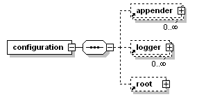

## 1. Logback 结构



## 2. 配置模板

### 2.1 需要输出控制台和输出到日志文件、日志文件存错7天

```xml
<?xml version="1.0" encoding="UTF-8"?>

<configuration debug="false">
  <property name="CONSOLE_LOG_PATTERN"
            value="%red(%date{yyyy-MM-dd HH:mm:ss}) %highlight(%-5level) %red([%thread]) %boldMagenta(%logger{50}) %cyan(%msg%n)"/>
  <!--定义日志文件的存储地址 勿在 LogBack 的配置中使用相对路径-->
  <property name="LOG_HOME" value="logs" />
  <property name="MODULE" value="app"/>
  <!-- 控制台输出 -->
  <appender name="STDOUT" class="ch.qos.logback.core.ConsoleAppender">
    <!-- encoder class为空时, 默认也为 ch.qos.logback.classic.encoder.PatternLayoutEncoder -->
    <encoder class="ch.qos.logback.classic.encoder.PatternLayoutEncoder">
      <pattern>${CONSOLE_LOG_PATTERN}</pattern>
    </encoder>
  </appender>
  <!-- 按照每天生成日志文件 -->
  <appender name="FILE"  class="ch.qos.logback.core.rolling.RollingFileAppender">
    <rollingPolicy class="ch.qos.logback.core.rolling.SizeAndTimeBasedRollingPolicy">
      <!--日志文件输出的文件名-->
      <FileNamePattern>${LOG_HOME}/${MODULE}.info.%d{yyyy-MM-dd}.%i.log</FileNamePattern>
      <!--日志文件保留天数-->
      <MaxHistory>7</MaxHistory>
      <maxFileSize>10MB</maxFileSize>
      <totalSizeCap>100MB</totalSizeCap>
    </rollingPolicy>
    <encoder class="ch.qos.logback.classic.encoder.PatternLayoutEncoder">
      <!--格式化输出：%d表示日期，%thread表示线程名，%-5level：级别从左显示5个字符宽度%msg：日志消息，%n是换行符-->
      <pattern>%d{yyyy-MM-dd HH:mm:ss.SSS} [%thread] %-5level %logger{50} - %msg%n</pattern>
    </encoder>
  </appender>
  <appender name="FILE_ERROR"  class="ch.qos.logback.core.rolling.RollingFileAppender">
    <rollingPolicy class="ch.qos.logback.core.rolling.SizeAndTimeBasedRollingPolicy">
      <!--日志文件输出的文件名-->
      <FileNamePattern>${LOG_HOME}/${MODULE}.error.%d{yyyy-MM-dd}.%i.log</FileNamePattern>
      <!--日志文件保留天数-->
      <MaxHistory>30</MaxHistory>
      <maxFileSize>10MB</maxFileSize>
      <totalSizeCap>100MB</totalSizeCap>
    </rollingPolicy>
    <encoder class="ch.qos.logback.classic.encoder.PatternLayoutEncoder">
      <!--格式化输出：%d表示日期，%thread表示线程名，%-5level：级别从左显示5个字符宽度%msg：日志消息，%n是换行符-->
      <pattern>%d{yyyy-MM-dd HH:mm:ss.SSS} [%thread] %-5level %logger{50} - %msg%n</pattern>
    </encoder>
  </appender>

  <!-- 日志输出级别 -->
  <root level="INFO">
    <appender-ref ref="FILE" />
  </root>
  <root level="INFO">
    <appender-ref ref="STDOUT" />
  </root>
  <!-- 日志输出级别 -->
  <root level="ERROR">
    <appender-ref ref="ERROR_FILE" />
  </root>
</configuration>
```

