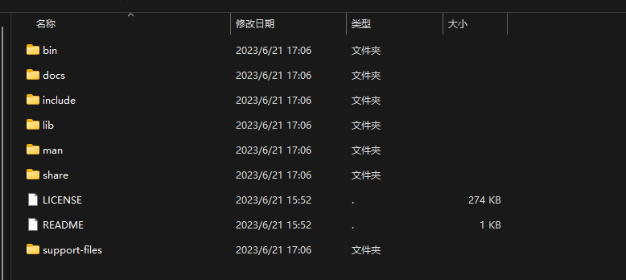

在制作项目安装包时候，特别是需要程序需要数据库，而且还是属于工具类型的项目，那么再交付给客户时，最好
在安装包中集成一整套的环境进去。例如: 数据库环境。

本文介绍一种在Linux 下绿色安装mysql 安装包的制作方式:

## 1. 下载MYSQL 压缩包

访问:[https://downloads.mysql.com/archives/community/](https://downloads.mysql.com/archives/community/) MySql 下载官网


注意: 操作系统(`Operating System`)选项中 选择: `Linux - Generic`

根据`glibc 版本`和`指令集`选择对应的压缩包，本文使用：`Linux - Generic (glibc 2.17) (x86, 64-bit), TAR`


解压压缩包后：可以看到3个文件:
- `mysql-8.1.0-linux-glibc2.17-x86_64.tar.xz`: MySql
- `mysql-test-8.1.0-linux-glibc2.17-x86_64.tar.xz`: MySql 测试套件
- `mysql-router-8.1.0-linux-glibc2.17-x86_64.tar.xz`: MySQL Router


这里我们只需要基本的 `mysql` 即可

## 2. 解压: `mysql-8.1.0-linux-glibc2.17-x86_64.tar`

```bash
  tar -xJf mysql-8.1.0-linux-glibc2.17-x86_64.tar
```



## 3. MySQL 初始化

```bash
  # 进入目录
  cd mysql-8.1.0-linux-glibc2.17-x86_64
  # 初始化后会生产一个 没有密码的 root 账户 并且会在当前目录生产 mysql 的一些文件，例如：data
  ./bin/mysqld --initialize-insecure
  # 启动
  ./bin/mysqld
```
