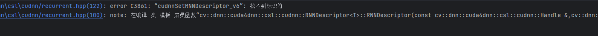
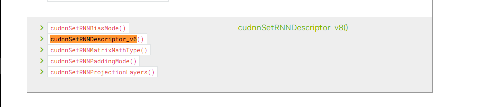
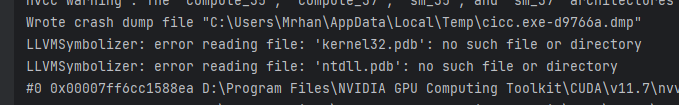

> 从源码编译 opencv 和 opencv-contrib 并指支撑 cuda


```shell
git clone https://github.com/opencv/opencv.git
git clone https://github.com/opencv/opencv-contrib.git
```

```shell
mkdir build
cd build
cmake -G Ninja \
  -D OPENCV_EXTRA_MODULES_PATH=..\..\opencv_contrib\modules \
  -D WITH_CUDA=ON \
  -D WITH_CUDNN=ON \
  -D CUDA_FAST_MATH=ON \
  -D WITH_OPENEXR=ON \
  -D OPENCV_ENABLE_NONFREE=ON \
  -D BUILD_JAVA=OFF \
  -D BUILD_opencv_python3=OFF \
  -D WITH_NVCUVENC=OFF \
  -D WITH_NVCUVID=OFF   ..
 
 make
```

如果编译的过程中报错: `error C3861: “cudnnSetRNNDescriptor_v6”: 找不到标识符`



这个是因为使用的 `cuDNN` 版本过高导致.

[NVIDIA 官方文档](https://docs.nvidia.com/deeplearning/cudnn/api/overview.html)



可以换用 `cuDNN v8`版本即可


错误: `LLVMSymbolizer: error reading file: 'kernel32.pdb': no such file or directory`



安装 `Windows SDK`

[https://developer.microsoft.com/en-us/windows/downloads/windows-sdk/](https://developer.microsoft.com/en-us/windows/downloads/windows-sdk/)
