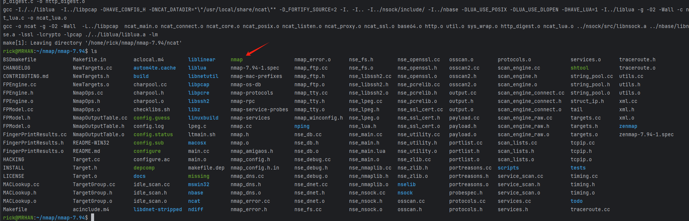
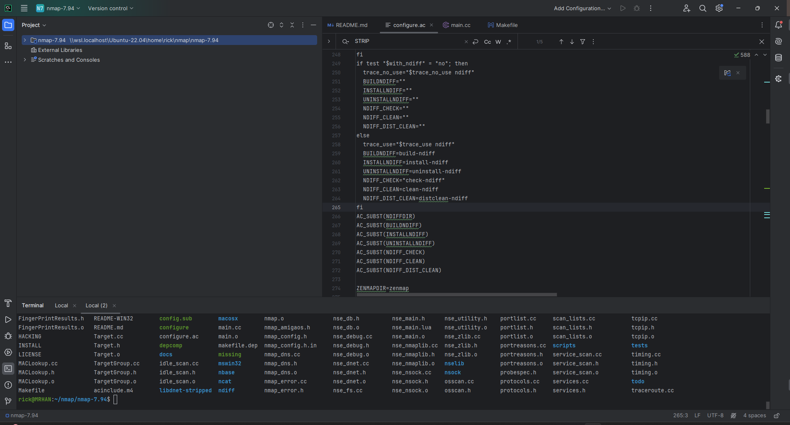
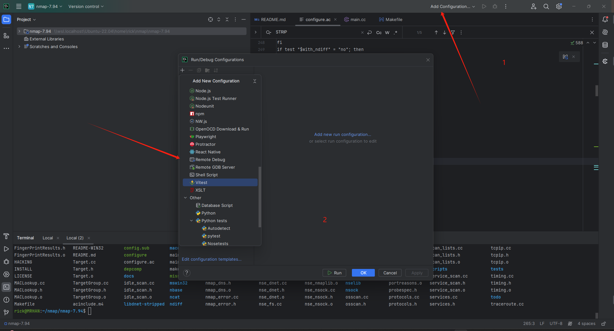
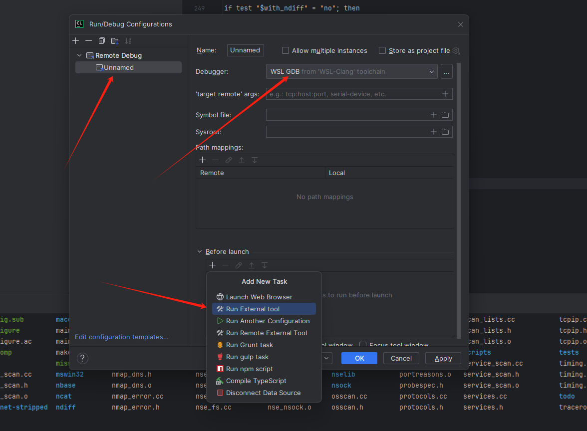
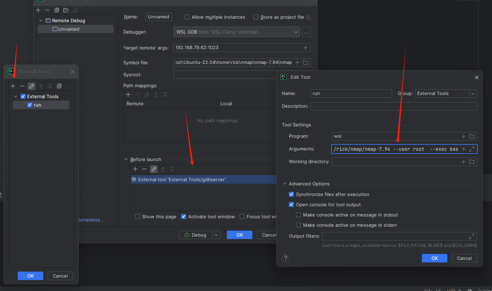
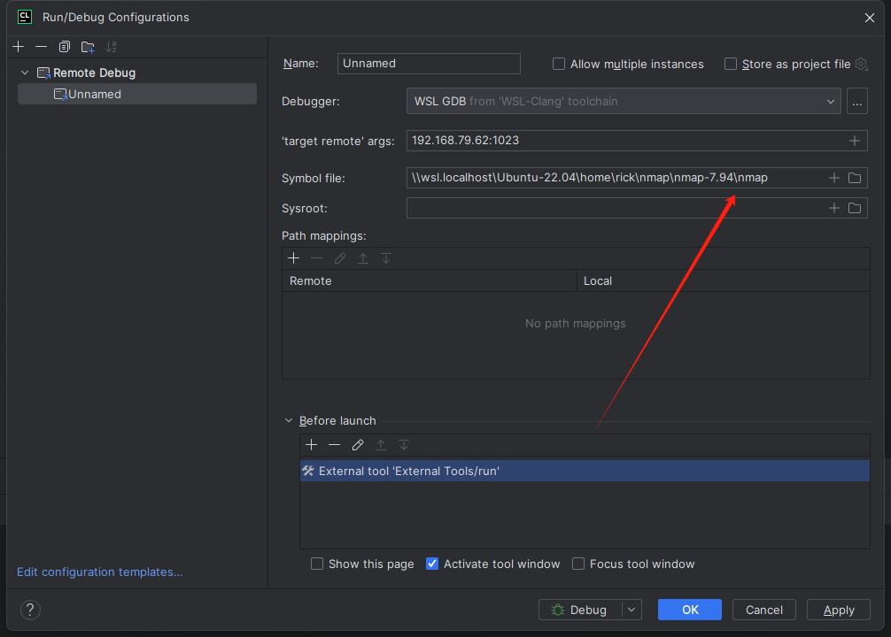
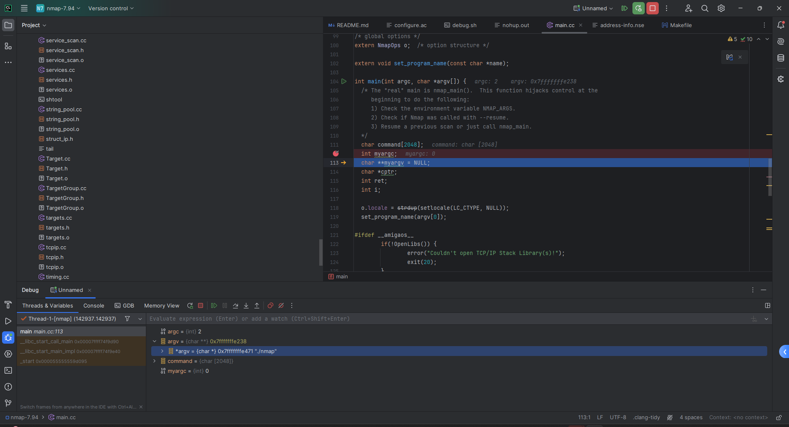

> windows 电脑上debug linux 程序真的是很操蛋。

本文给你提供一个基于 Clion 非常方便调试办法

## 环境:

- 开发工具: `Clion`
- 演示开源程序: `nmap-7.94`
- 依赖工具: `autotools` `gdbserver` `make`

> eg: 源码编译安装等过程这里就不演示了，有问题，就兵来将挡水来土掩

## ShowTime

```shell
 git clone https://github.com/nmap/nmap.git
 # 检测环境
 ./configure
 # 编译
 make
```

到此为止，非常正常，毫无问题。更目录下会生成 `nmap`的程序。



### 主角: `nmap`

打开`Clion` 并且打开 子系统目录


开始装逼:

创建 `debug.sh` 
```
# 构建

make 
# 关闭 之前的gdbserver 以避免无法启动
pkill -9 gdbserver
# 启动GDB Server
echo "Start GDBServer"
nohup gdbserver :1023 ./nmap --help &
sleep 1s
echo "Started"
```




- 添加一个 `before action` 然后在这个里面进行编译和启动
```shell
wsl --cd "运行目录" --user "运行用户" --exec "执行命令" "参数"
wsl --cd /home/rick/nmap/nmap-7.94 -user root  --exec ./debug.sh
```
> eq: 使用 `run.sh` 非常方便修改参数


注意：debug 还需要`符号文件` 可以直接选则编译生成的程序即可。



> eg: 如果是远程编译，并非子系统，可以在 debug.sh 中下载编译之后的文件到本地

完美运行：




## 总结:

1. clone
2. 目标机器编译成功
3. clion 远程gdb
4. 添加`Run/Debug 配置`时候添加一个环境准备的动作 启动 gdbserver


## 链接

  1. [Nmap 官网](https://nmap.org/)
