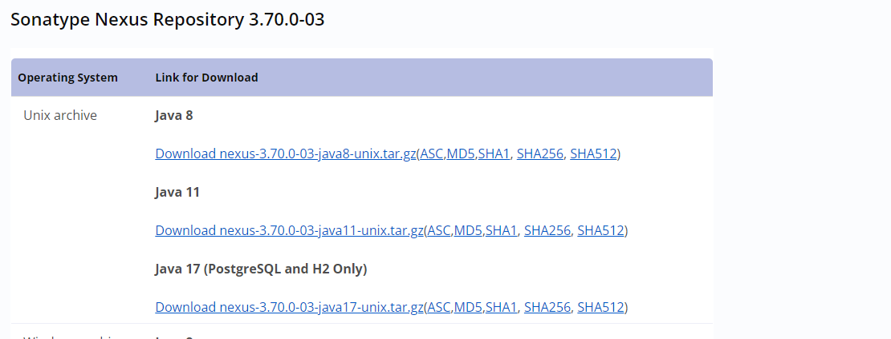
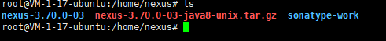

> 原本在阿里云的机器由于一些原因需要迁移至腾讯云。原本部署在Nexus 的服务也需要进行迁移过去。
> `放在云上使用的原因是因为跨地区协同办公`

## 环境准备

> 新、旧服务器操作系统版本基本一致

迁移前，首先需要进行如下操作：

1. 新服务器安装`Nexus`
2. 备份旧服务器的 `sonatype-work` 目录，一般为`Nexus` 安装目录的同级
3. 复制 旧服务器的 `sonatype-work` 到新服务器


## 安装 `Nexus`

> 依赖: jdk 环境

前往下载页面下载对应压缩包: [Nexus](https://help.sonatype.com/en/download-archives---repository-manager-3.html)


解压后：  


打包 `sonatype-work`:  
```shell
  # 使用tar 命令进行打包压缩
  tar -cjvf data.tar.gz ./sonatype-work
```

打包完成后使用`scp`或者怎么着也行把压缩包上传至新服务器的 `nexus`安装目录

新服务器解压 `data.tar.gz`
```shell
  tar -xvjf nexus3.tar.bz2 
```
等待解压完成后。直接启动

```shell
  ./nexus-3.70.1-02/bin/nexus start
```


