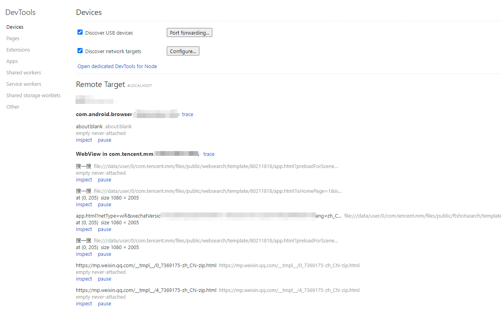
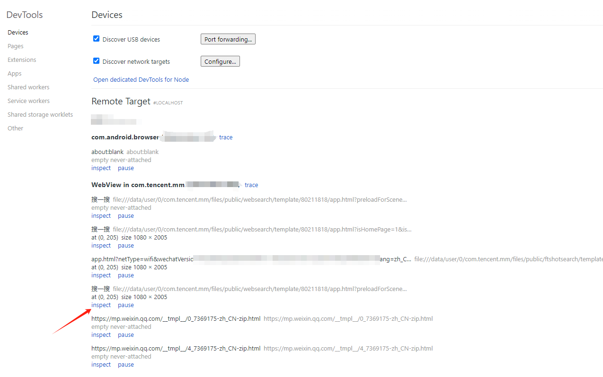
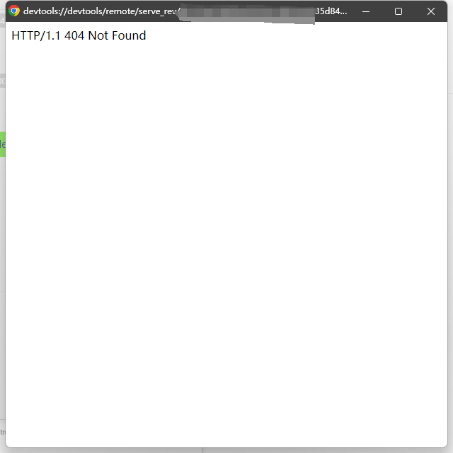
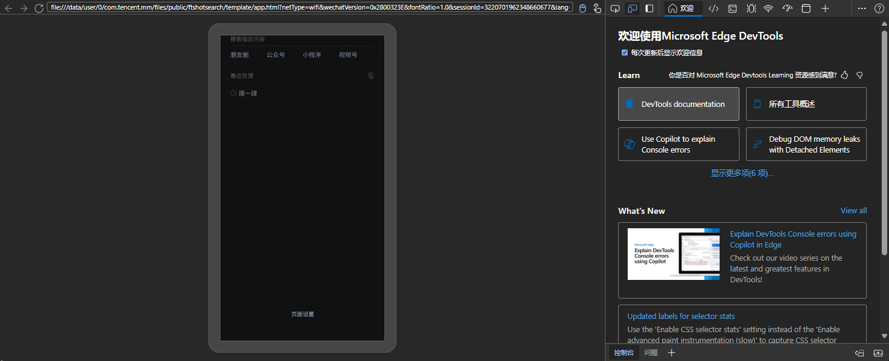

## 前期准备:

1. 一部手机
2. 一条数据线
3. 一台电脑

## 开始操作

1.首先用数据线把手机连接到电脑
2.手机打开USB调试
3.手机进入微信随便打开一个聊天窗口输入并发送：   http://debugxweb.qq.com/?inspector=true
点击打开这个链接，弹出“执行成功”，即可

4.手机微信打开想要抓包调试的网页
5.电脑上打开chrome内核的浏览器或edge浏览器

- chrome内核的浏览器输入chrome://inspect/#devices
- edge浏览器输入：edge://inspect/#devices

打开后稍等片刻

> 目前使用Edge 浏览器非常流程。Chrome 老是404

等待全部加载出来后，按照你的需要进行点击 `inspect`

比如: 微信搜一搜

---
我电脑的Chrome 会404

---

成功后：

到这一步，你就可以开始你的奇妙之旅

## 参考

  - https://www.52pojie.cn/thread-1826013-1-1.html
