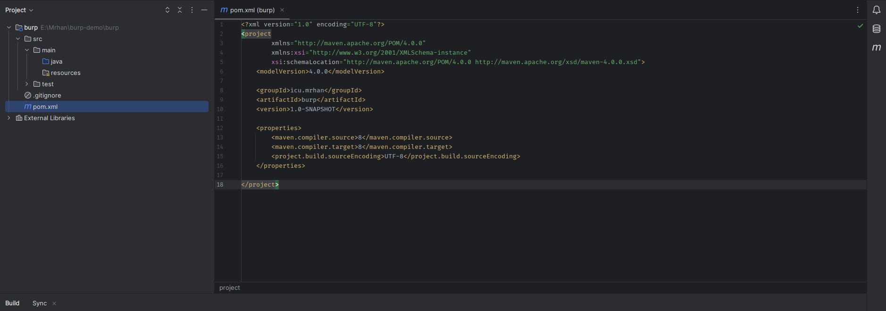
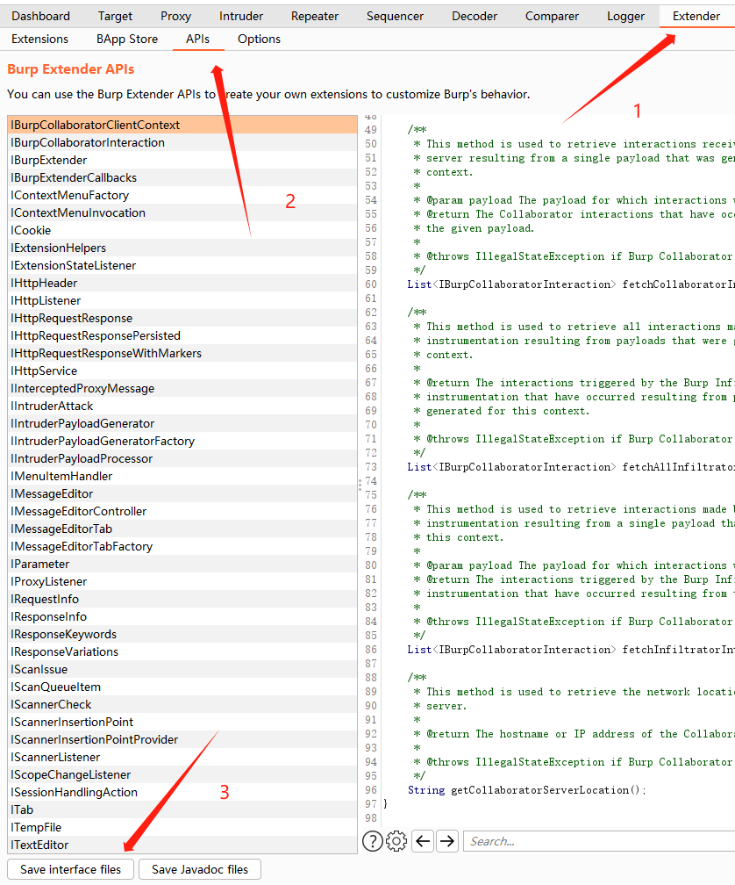
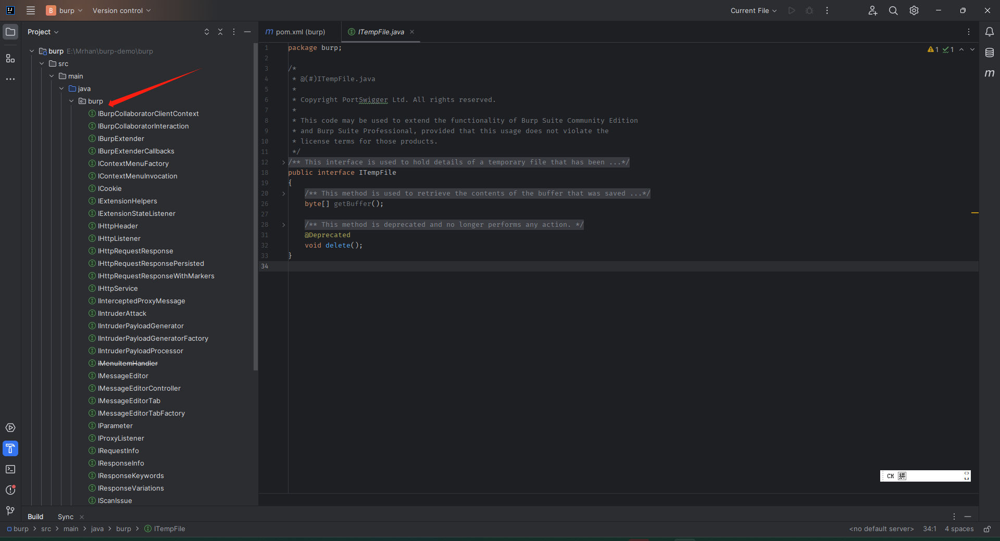

> 环境准备：
> 1. Burp suite
> 2. JDK Java开发环境


## 1. 创建项目

- 使用JetBrains Idea 创建Java项目



- 打开Burp Suite 导入API



注意，选择接口保存的目录一定是项目根目录，在操作完成后项目中会生成一个 burp Java包




## 2. 开发插件

在项目的 burp包下面创建一个：`BurpExtender.java` 文件，实现与: `IBurpExtender`

```java
  package burp;
  /**
   * @author Mrhan
   * @date 2023/9/23 10:30
   */
  public class BurpExtender implements IBurpExtender{
      @Override
      public void registerExtenderCallbacks(IBurpExtenderCallbacks callbacks) {
  
      }
  }

```
