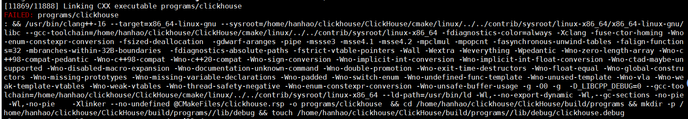
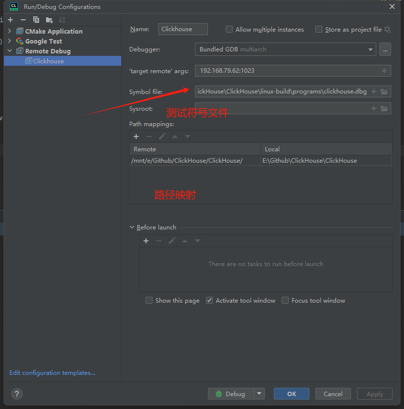
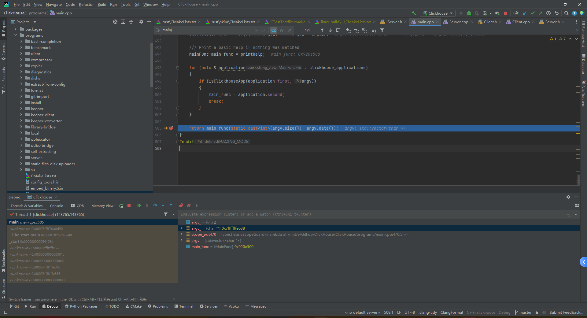

> 本文主要介绍Clickhouse 源码编译的指南

**开发环境**
1. 开发工具:`Intellij Clion` 开发工具
2. 操作系统:`Ubuntu 22` 系统
3. 编译所需内存：建议是32G 内存
4. 编译环境：`clang-16` `gcc` `nasm` `yasm`
5. 构建关系：`CMake` `Ninja`
6. 调试工具：`gdb-server`

- `llvm clang` 下载地址: https://github.com/llvm/llvm-project/releases/tag/llvmorg-16.0.3


## 1. 环境准备

> eg: 如果网络环境比较不Ok的可以先配置上代理:   
> `export HTTP_PROXY=http://192.168.0.111:7890`  
> `export HTTPS_PROXY=http://192.168.0.111:7890`

1. 拉取源代码：

```shell
git clone https://github.com/ClickHouse/ClickHouse.git
```


```shell
cd Clickhouse
# 更新所有clickhouse 所需要的git submodules 如果这一步出现网络超时或者其他情况, 建议配置代理并且多执行几次
git submodule update --init -f
ls -l
```


```shell
# 新建build 目录
mkdir build
cd build
# cmake 生成构建脚本 需要使用 llvm-clang 进行编译 禁止 ccache
cmake -DCMAKE_BUILD_TYPE=Debug -DCMAKE_C_COMPILER=clang-16 '-DCMAKE_CXX_COMPILER=clang++-16' -G Ninja -DLINKER_NAME=ld -DCOMPILER_CACHE=disabled ..
```


2. 环境检测成功后，可以进行编译

```shell
# ninja 进行编译 -j 8 8个 job 同时进行
ninja -j 8
```


3. 编译过程中可能会出现这个错误:



这个错误是因为 在 `执行 linker`阶段内存不够导致的。可以通过开启 swap 或者 扩大内存来解决这个问题。

> 具体如何扩大 swap 交换区可以自行百度
 
```shell
sudo fallocate -l 20Gb /helloswap
sudo chmod 600 /helloswap
sudo mkswap /helloswap
sudo swapon /helloswap
```

4. 编译成功，启动！

# 2. 基于gdb server 远程调试

安装`gdb` `gdb server`

```shell
sudo apt-get install gdb gdbserver
```

生成Debug符号文件

```shell
objcopy --only-keep-debug ./programs/clickhouse ./programs/clickhouse.dbg
```

开启远程调试

```shell
# 启动程序
sudo gdbserver :1023 ./programs/clickhouse server

```


**使用 Clion 进行远程调试 **

环境准备： 打开源码

1. 添加 `Remote Debug`



2. 点击开始 `DEBUG`
   


然后根据你的需求进行打断点，调试就可以了


