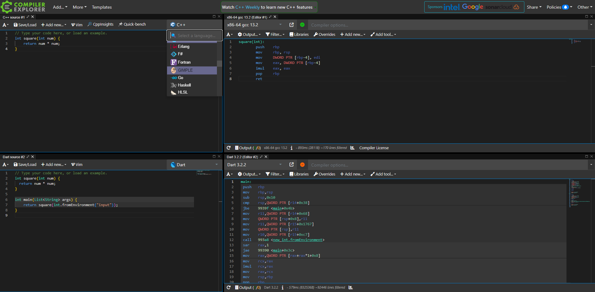
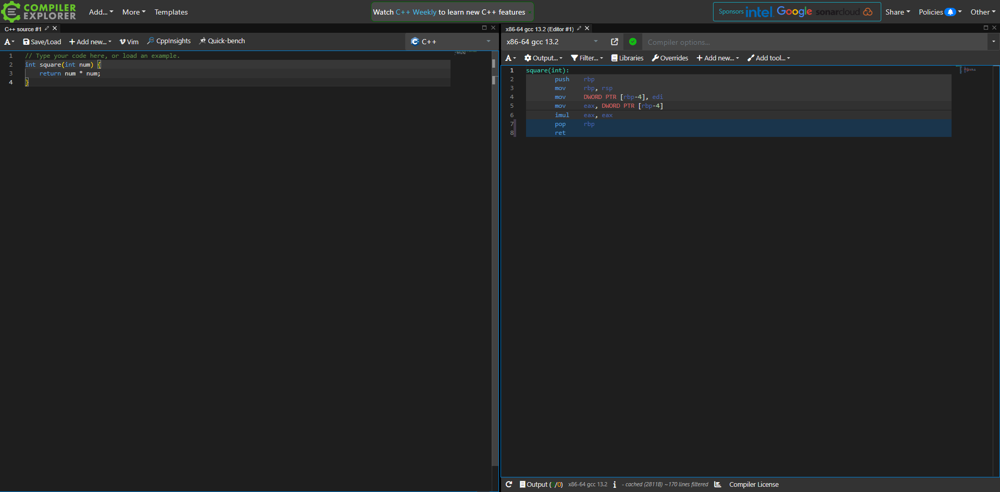
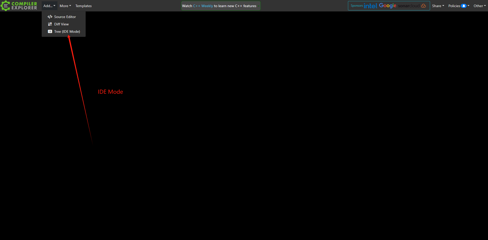
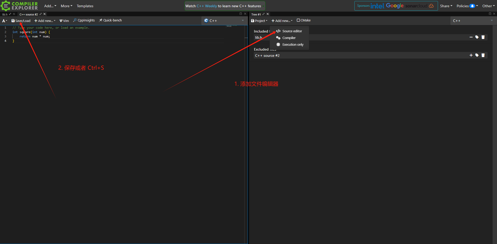
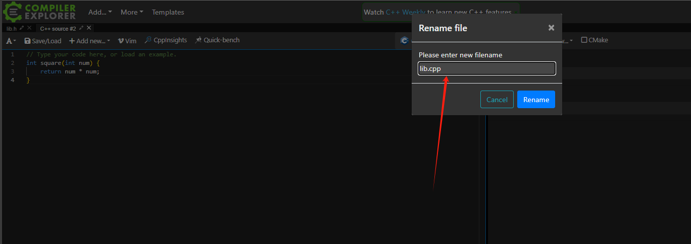
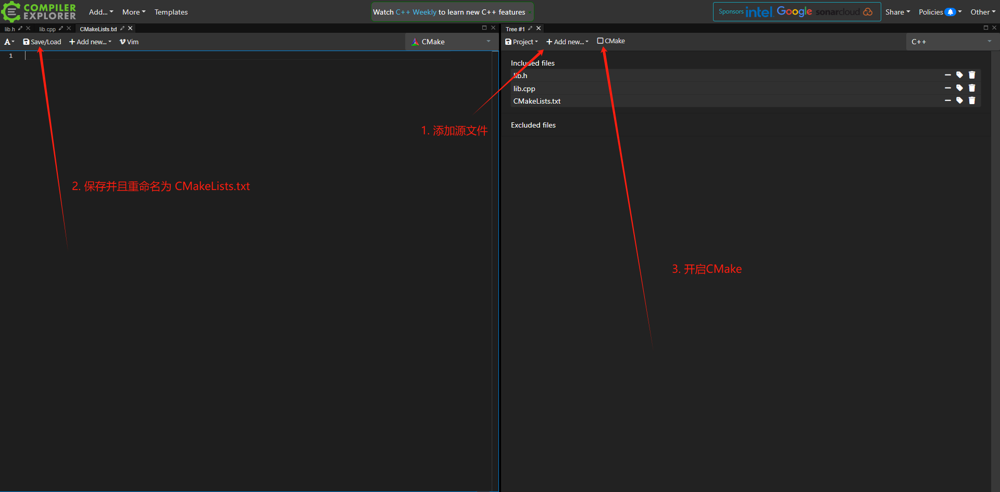
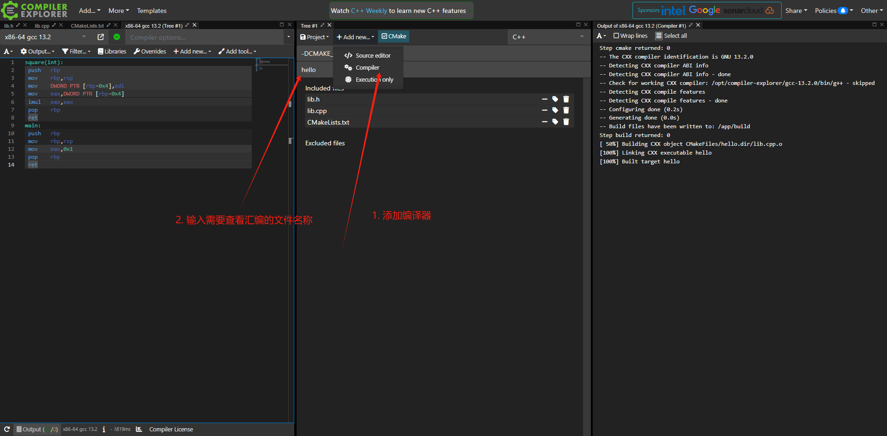
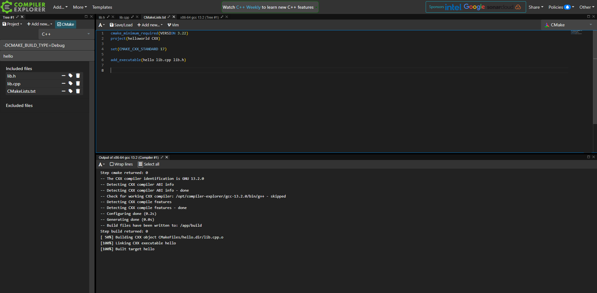

> Godbolt 一个很强大的东西！！

[go Godbolt](https://godbolt.org/)


Godbolt 可以非常方便的查看很多语言底层编译产物


这里那`C/C++`举例子:



可以看到我们可以编译单个C++文件

如果我们想编译复杂的源代码，这时候我们可以使用`CMake`来进行编译配置

## 基于CMake的多文件编译:

1. 打开 `IDE` 模式

先关闭所有窗口





2. 添加 `CMakeLists.txt` 文件



编写好 `CMakeLists.txt`
```cmake
cmake_minimum_required(VERSION 3.22)
project(helloworld CXX)

set(CMAKE_CXX_STANDARD 17)

add_executable(hello lib.c lib.h)

```

3. 添加编译器




到此，就可以使用`CMake` 来编译多个C++文件了
