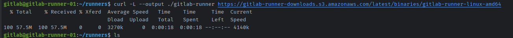

## 1. Gitlab Runner

在极狐GitLab 中，runners 是运行 CI/CD 作业的代理。

您可能已经有可用于您的项目的 runner，包括共享 runner，它们可用于您的实例中的所有项目。
要查看可用的 runner：

转到 `设置` > `CI/CD` 并展开 `Runners`。

只要您至少有一个有效的 runner，旁边有一个绿色圆圈，您就有一个 runner 可以处理您的作业。

如果 UI 中的 `Runners` 页面上没有列出任何 runner，您或管理员必须安装 `GitLab Runner` 和注册至少一名 runner。

如果您正在测试 `CI/CD`，您可以在本地机器上安装 `GitLab Runner` 并注册 runner。 当您的 `CI/CD` 作业运行时，它们会在您的本地机器上运行。

可以看到，目前私有的 `Gitlab` 仓库中是没有任何 `Runners` 这就代表着我们的 `Gitlab` 中的 `CI/CD` 是无法执行的。
这时候需要我们进行注册 `Runners` 来执行这些 `CI/CD`

## 2. 安装/注册 Runners

找一台机器，进行安装部署，如果 `Gitlab` 是在云服务器中，有固定的公网IP或者域名，`Runner` 可以不用和 `Gitlab` 在一个公网网段中，
只需要 `Runner` 可以访问 `Gitlab` 即可。本教程中使用的 `Gitlab` 是部署在云服务中。`Runner` 着安装到 公司内内网机房服务器中。

随便找一台内网服务器:

下载 `Runner`

进行后续步骤

**开始注册**

详细注册流程：[https://docs.gitlab.cn/runner/register](https://docs.gitlab.cn/runner/register)
