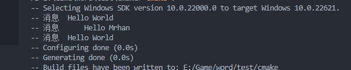
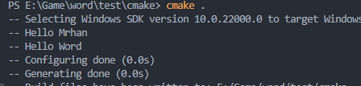
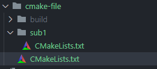
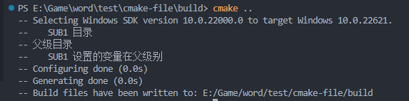

---

title: CMake 设置变量
category: [构建工具, CMake]
tags: [CMake, CPP, 构建工具, 更新中]
---
# 1. CMake 变量分类
## 1.1 普通变量 

变量是 CMake 语言中的基本存储单元。它们的值始终是字符串类型，尽管某些命令可能会将字符串解释为其他类型的值。
`set()`和`unset()`命令显式设置或取消设置变量，但其他命令也具有修改变量的能力。
变量名称区分大小写，几乎可以包含任何文本，但我们建议使用`字母` `数字` `_(下划线)`来命名变量。

变量具有动态范围,使用`set`或`unset`在当前范围内创建一个变量：

- 块作用域 `(v3.25)`:
  
  使用`block()` 和 `endblock()`命令来创建一个新的变量作用域，需要`CMake 3.25` 以上版本
  ```cmake
    cmake_minimum_required(VERSION 3.25)
    project(cmake_test)
    set(hello "Hello World")
    message(STATUS  "消息  ${hello}")
    block()
      set(hello "Hello Mrhan")
      message(STATUS  "消息      ${hello}")
    endblock()
    message(STATUS  "消息  ${hello}")
  ```
  
  
- 函数范围

  函数作用域和`block` 作用域类似。当在函数内通过`set`或`unset`将变量与`当前函数进行作用域`进行绑定
  ```cmake
    set(hello "Hello")
    set(name "Word")
    function(foo)
    set(name "Mrhan")
    message(STATUS "${hello} ${name}")
    endfunction()
    foo()
    message(STATUS "${hello} ${name}")
  ```
  
  
- 目录范围
  
  CMake 会为定义在每个目录下的`CMakeLists.txt`中设置的变量绑定到当前目录。
  在处理`CMakeLists.txt` 之前，会将父目录的变量初始化到当前目录作用域中。
  子目录的`CMakeLists.txt`会将父目录的所有变量拷贝到当前`CMakeLists.txt`中，当前`CMakeLists.txt`中的变量的作用域仅在当前子目录有效。  
  <br/>
  目录作用域有两个特点：`向下有效` `值拷贝`

  - 目录结构
    
     
  
  - 父目录CMakeLists.txt
      ```cmake
      cmake_minimum_required(VERSION 3.25)
      project(cmake_test)
      set(ROOT_VAR "父级目录")
      add_subdirectory(sub1)
      message(STATUS ${PARENT_SUB_DIR})
      ```
  - 子目录CMakeLists.txt
    
      ```cmake
      set(SUB_DIR "   SUB1 目录")
      set(PARENT_SUB_DIR "   SUB1 设置的变量在父级别" PARENT_SCOPE)
      message(STATUS ${SUB_DIR})
      message(STATUS ${ROOT_VAR})
      ```    
  - 执行结果
    
    

- 永久缓存

CMake 定义普通变量方式
```cmake
  # 普通变量
  
  set(<variable> <value>... [PARENT_SCOPE])
  # 缓存变量 
  set(<variable> <value>... CACHE <type> <docstring> [FORCE])
  #- variable：变量名称
  #- value：变量值列表
  #- CACHE：cache变量的标志
  #- type：变量类型，取决于变量的值。类型分为：BOOL、FILEPATH、PATH、STRING、INTERNAL
  #- docstring：必须是字符串，作为变量概要说明
  #- FORCE：强制选项，强制修改变量值
```

# 参考
  - [CMake 官网](https://cmake.org/cmake/help/latest/manual/cmake-language.7.html#variables)
