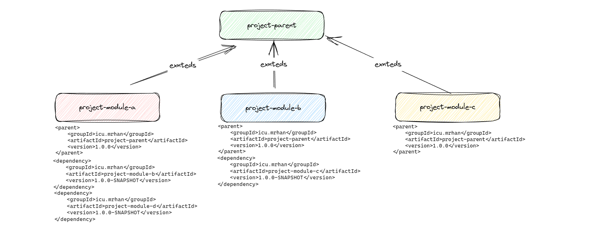

# 版本管理

> 版本管理主要解决的核心问题是明确再不同时间项目代码发生了什么功能变更, 其次在模块依赖的过程中可以明确知道: `A模块`
> 需要`依赖B模块`的什么版本。 这样以来出现问题之后可快速定位问题、排查问题。

-

版本控制：可以跟踪和管理软件项目中使用的不同模块的版本。这对于开发团队来说非常重要，因为不同的模块可能会有不同的功能、修复不同的错误或提供不同的性能。通过版本控制，团队可以清楚地知道项目中每个模块的当前版本和历史变更，以及如何升级或降级模块。

- 协作与合并：在多人协作的软件开发项目中，不同的开发人员可能会同时对同一个模块进行修改。模块版本管理系统可以帮助团队成员合并彼此的修改，并解决潜在的冲突。通过版本管理系统，开发人员可以更好地协作，避免意外覆盖或丢失对模块的修改。
- 故障排除和回退：当一个软件项目中的模块发生故障或出现错误时，模块版本管理系统可以帮助开发团队快速定位问题。通过追踪模块版本和变更历史，团队可以回溯到故障发生之前的可靠状态，排除故障并恢复系统功能。
- 发布和部署：模块版本管理也涉及到软件模块的发布和部署。通过版本管理系统，开发团队可以对每个模块的发布进行控制，确保只有经过测试和验证的模块被部署到生产环境中。版本管理系统还可以跟踪已部署模块的状态，以便在需要时进行回滚或升级。

在以下环境中有多个模块（文中只列举了 `a` `b` `c`等子模块）,不同的子模块又被其他模块进行依赖，
如果不考虑`版本管理`、`团队协作`等部分，则可以一直沿用`1.0.0-SNAPSHOT`版本号进行功能的迭代和生升级。
但是通常情况下，是需要进行对版本进行管理的，不同版本需要留存一定时间的记录，方便遇到问题及时回退也方便功能开发是进行隔离。
避免未更新的模块收到新改动的内容影响。

但是想象始终是美好的，现实总是残酷的。随着项目越来越大，开发人员越来与越多，模块之间依赖管理难度直线上升，这时候就需要有一个好的版本管理方案。
这里不讨论关于整个版本管理的大部分，只针对于版本管理中的一个环节 => `版本号管理`

解决版本号问题的终极插件: [versions-maven-plugin][1]

## 场景

> 多模块基本场景 (`eg: 部分pom.xml 内容省略`) 依赖包含：SNAPSHOT依赖和 RELEASE（无后缀）依赖



### 父模块

> 所有模块的父模块

```xml

<project>
  <groupId>icu.mrhan</groupId>
  <artifactId>project-parent</artifactId>
  <version>1.0.0-SNAPSHOT</version>
</project>
```

### A模块

```xml

<project>
  <parent>
    <groupId>icu.mrhan</groupId>
    <artifactId>project-parent</artifactId>
    <version>1.0.0-SNAPSHOT</version>
  </parent>
  <artifactId>project-module-a</artifactId>
  <version>1.0.0-SNAPSHOT</version>
  <dependencies>
    <dependency>
      <groupId>icu.mrhan</groupId>
      <artifactId>project-module-b</artifactId>
      <version>1.0.0-SNAPSHOT</version>
    </dependency>
    <!-- 此模块用于表示更多的模块 -->
    <dependency>
      <groupId>icu.mrhan</groupId>
      <artifactId>project-module-d</artifactId>
      <version>1.0.0-SNAPSHOT</version>
    </dependency>
  </dependencies>
</project>
```

### B模块

```xml
<project>
  <parent>
    <groupId>icu.mrhan</groupId>
    <artifactId>project-parent</artifactId>
    <version>1.0.0-SNAPSHOT</version>
  </parent>
  <groupId>icu.mrhan</groupId>
  <artifactId>project-module-b</artifactId>
  <version>1.0.0-SNAPSHOT</version>
  <dependencies>
    <dependency>
      <groupId>icu.mrhan</groupId>
      <artifactId>project-module-c</artifactId>
      <version>1.0.0-SNAPSHOT</version>
    </dependency>
  </dependencies>
</project>
```

### C模块

```xml
<project>
  <parent>
    <groupId>icu.mrhan</groupId>
    <artifactId>project-parent</artifactId>
    <version>1.0.0-SNAPSHOT</version>
  </parent>
  <groupId>icu.mrhan</groupId>
  <artifactId>project-module-c</artifactId>
  <version>1.0.0-SNAPSHOT</version>
  <dependencies>
    <dependency>
      <groupId>icu.mrhan</groupId>
      <artifactId>project-module-e</artifactId>
      <version>1.0.0-SNAPSHOT</version>
    </dependency>
  </dependencies>
</project>
```

[1]:https://www.mojohaus.org/versions/versions-maven-plugin/index.html
