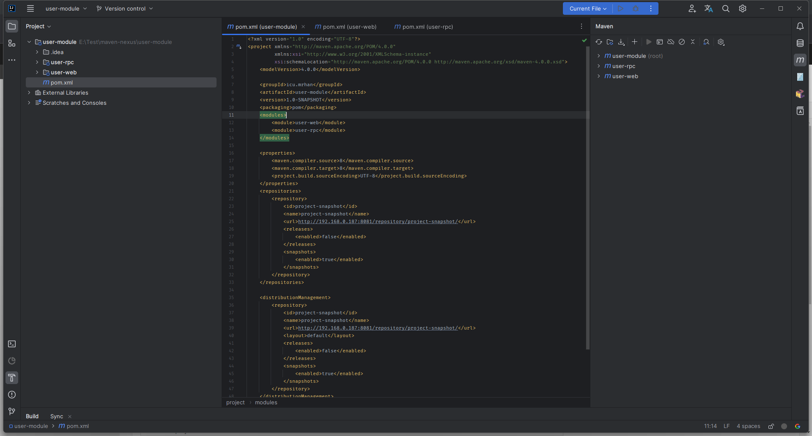
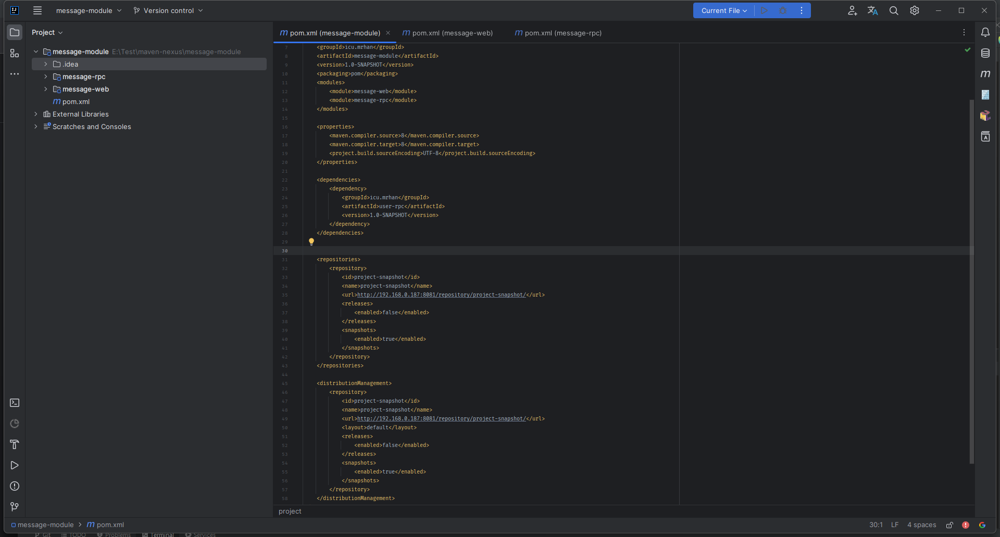
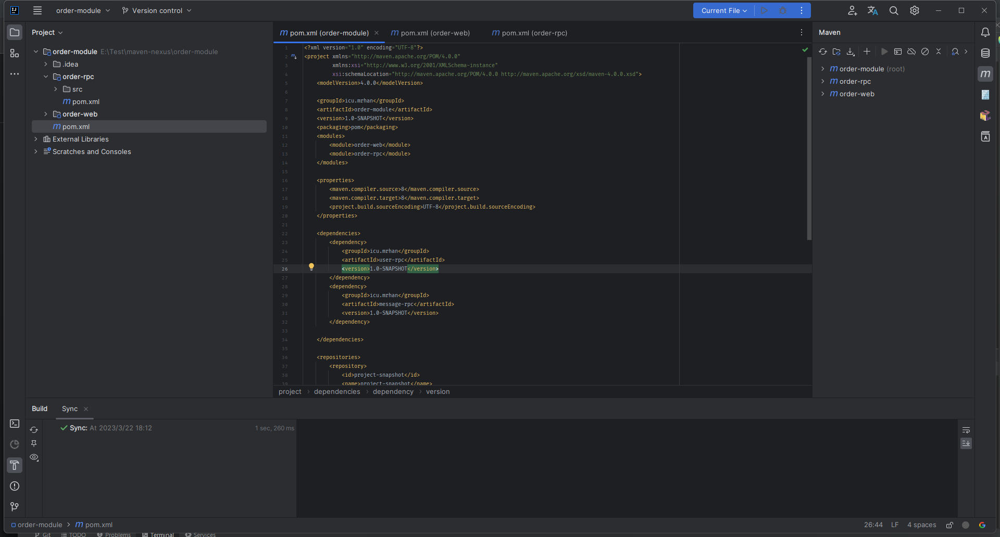

# 1. 概述

在单位项目开发的过程中，不同模块存在于不同代码仓库中，难免不了存在模块之间的依赖。

例如: 有如下项目, 有如下业务模块 
- `user-module`: 用户基础信息管理 
- `order-module`: 负责管理订单信息
- `message-module`: 负责消息通知

**user-module**

**message-module**

**order-module**

